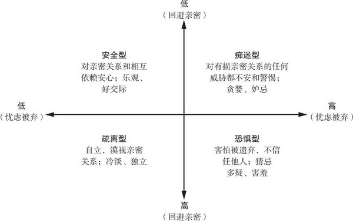
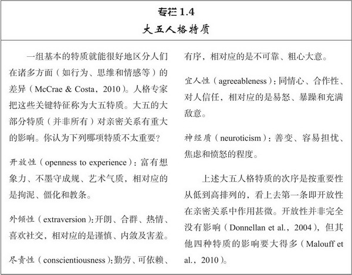
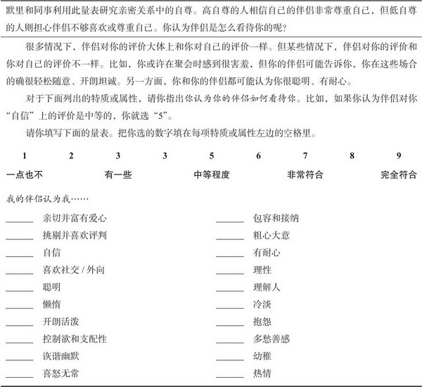

[toc]

# 第1章 人际关系的构成

- 亲密关系的基本构成要素：
  - 传承的文化
  - 遭遇的经历
  - 拥有的人格
  - 共同的遗传以及人际交往

## 亲密关系的性质和重要性

### 亲密关系的性质

- 亲密关系和泛泛之交至少在六方面存在程度差异：
  - 了解
  - 关心
  - 相互依赖型
  - 相互一致性
  - 信任
  - 承诺
- 人们相信亲密关系不会带来伤害，并期望伴侣能满足自己的要求，关注自己的幸福。如果丧失了这种信任，亲密伴侣也常常会变得猜忌与疑虑，以致损害亲密关系特有的开朗、坦诚和相互依赖
- 一般而言，最令人满意和最有意义的亲密关系应当包括亲密关系的所有六个特征。但亲密关系如果只有部分特征，亲密程度就会减弱。正如不幸福的婚姻所揭示的，在整个关系的过程中亲密程度波动极大。

### 归属需要

- 当我们珍视的人际关系出现危机时，我们往往会魂不守舍，进而变得癫狂痴迷，这充分表明亲密关系对我们的重要性。归属需要的力量还表现在，当人们长期处在极度孤单的状态时，会表现出强烈的紧张应激反应；任何对亲密关系构成威胁的事物，都让人难于接受
- 总的说来，我们的幸福感看来取决于归属需要的满足程度。

## 文化的影响

### 亲密关系变化的根源

- 这种对自我实现的重视会让我们期望从亲密关系中获取比上一辈更多的东西——更多的快乐和享受，更少的麻烦和付出。而与上一代不同（他们往往会“为了孩子”而勉强生活在一起），我们只要对婚姻不满意，就会理直气壮地结束夫妻关系，重新追求满意的亲密关系。相形之下，东方文化更倡导集体主义的自我感，人们与家庭和社会团体的联系更为紧密。集体文化国家（如日本）的离婚率比美国低得多。
- 然而，影响人际关系规范更重要（但却很微妙）的因素是特定文化下青年男女的相对数量。男多女少的社会和女多男少的社会往往有着不同的人际关系标准。描述文化这种特性的指标就是性别比率
- 人们可能意识不到性别比率变化的重要性。高性别比率的社会（女性较少）倾向于支持老式、传统的两性性别角色，即男主外女主内，妻子在家相夫教子，丈夫外出工作养家。这种文化形态在性生活上也相对保守。理想的新娘应该是处女，未婚先孕让人蒙羞，公开同居几乎绝迹。妇女更早结婚，离婚不受欢迎。
- 低性别比率的社会（男性较少）则倾向于颠覆传统，也更为宽容。鼓励妇女外出工作以自立，默许（虽不提倡）婚外性关系的存在。如果不慎怀孕，成为未婚妈妈也无可厚非。各个历史时期的具体情形可能有所不同，但这种基本模式却是贯穿整个历史的。古罗马时代性别比率低，以骄奢淫逸而闻名。维多利亚时期的英格兰性别比率高，以贞洁守礼而著称。美国喧嚣的20世纪20年代性别比率低，是随心所欲、恣意寻欢的十年。那么出现“性解放”和“女权运动”的20世纪60年代晚期，性别比率高还是低？答案是非常低。
- 文化波动产生的现象与强势人群（男性）有关。（只是一种假设）
- 当女性较少时，男人得到一位女性芳心，就鼓励女子称为家庭主妇，反对离婚。如果女性过剩，女性的得到工作，推迟结婚，方便离婚。
- 综上，社会文化中的两性比例和人际关系规范等文化因素影响亲密关系。

## 个人经历的影响

- 婴儿有三种依恋类型，与幼时经历有关。

- 发展心理学家很早就发现，婴儿对其主要照料者（常为妈妈）的依赖表现出不同的模式。人们普遍认为，某些婴儿只要饥饿、尿床和受到惊吓，就能发现马上会得到悉心的照顾和呵护。婴儿哭喊时，慈爱的照料者总是如约而至，得到此种呵护的小宝贝们就能舒心地依赖他人，觉得他人可以信任，能从别人那里获得安全和友善。结果，这些儿童就发展出安全型依恋：他们快乐地与他人交往，很容易与他人发展出轻松信任的人际关系。
- 其他婴儿的情形可能不同。如果大人对孩子的照料无法预测而且并不持续，照料者有时热情关注，有时却心不在焉、焦急烦躁，有时根本就不出现。这些孩子就会对他人产生焦虑、复杂的情感，这种依恋类型就是焦虑—矛盾型。这些孩子由于不能确定照料者是否以及何时会回来关照自己，与他人的关系就会变得紧张和过分依赖，表现出对他人的过分贪求。
- 最后第三组婴儿的照料者在关照孩子时，带着拒绝或敌对的态度勉强为之。孩子就会认为他人是靠不住的，因而在与他人的关系上畏缩不前，表现出回避型依恋。回避依恋型的孩子经常怀疑和迁怒他人，不容易形成信任和亲密的人际关系。
- 当儿童面对危险的陌生环境时，安全型的儿童会跑向妈妈，很快安静下来，然后开始勇敢地探索陌生的新环境。焦虑—矛盾型的儿童则会大哭大闹，紧紧抱住妈妈，完全不顾父母的安全保证。而回避型的儿童往往躲开大人，保持和父母的距离，即使在害怕时也不愿意发生亲密接触。
- 研究者很快发现，成人有四种而非三种依恋模式。人际关系专家巴塞洛缪指出，人们避免和他人亲密接触，有两种不同的原因。一种情况是人们期望和他人交往，但又对他人戒心重重，害怕被人拒绝和欺骗。另一种情况是人们独立自主、自力更生，真正地喜欢我行我素和自由自在，而不愿意与他人发生紧密的依恋关系。
- 因此，巴塞洛缪认为成人有四种依恋类型。第一种安全型，和儿童的安全型依恋完全相同。第二种痴迷型，是巴塞洛缪给焦虑矛盾型的新名称，因为这种类型的人若要感觉心安，就得过分地依赖于他人的赞许，所以他们过度地寻求认同，沉溺于人际关系，担心关系破裂。
- 第三和第四种依恋类型反映了两种不同的“回避型”。恐惧型的人因为害怕被拒绝而极力避免和他人发生亲密关系。虽然他们希望有人喜欢自己，但更担心自己因此离不开别人。相反，疏离型的人认为和他人发生亲密关系得不偿失。他们拒绝和他人相互依赖，因为他们相信自己能自力更生，也不在乎他人是否喜欢自己。
- 
- 怀孕时快乐的准妈妈与焦虑矛盾的准妈妈相比，前者的孩子在1年后更可能具有安全型依恋。婴儿出生后，悦纳亲密、夫妻和睦的妈妈一般能成为周到体贴、充满爱心的照料者，故而安全型的妈妈往往有安全型的孩子，而不安全型的妈妈则往往也有不安全型的孩子。不过，即使婴儿天生难缠、易怒，如果训练妈妈们养护婴儿时的敏感性和回应性，她们的孩子则比没有接受类似训练的妈妈们的同类孩子更可能表现出安全型依恋。妈妈对儿童依恋类型的影响在学前期之后仍未结束。7年级的少年接受的养护能预测他们成年后在爱情和友谊中的行为表现；父母给予关爱和支持的少年在数年后对待恋人和朋友更加热情。毫无疑问，年轻人把从家中学到的经验运用到了以后的人际关系上。
- 然而，我们并不会被动地受童年经验的束缚，因为依恋类型不断地受到我们成人后经历的影响。依恋类型既然是习得的，就可能发生变化。随着时间的推移，依恋类型的确会发生新的改变。一次悲痛欲绝的分手会让原本安全型的人不再安全，一段如胶似漆的恋情也能慢慢让回避亲密的人不再怀疑和戒备亲密感情。在两年之内，足有三分之一的依恋类型可以发生实质性变化。
- 尽管依恋能改变，但它们一旦确立后，既稳定又持久，并影响人们新建立的人际关系，加强已有的行为倾向。例如，恐惧型的人如果坚持孤僻，回避相互依赖，就可能永远不会发现有些人可以信任，不会发现亲密可以令人心安，这又加重了他们的恐惧型依恋。如果没有大起大落的新经历，人们的依恋类型可以持续数十年。

## 个体差异的影响

- 情侣双方某些依恋类型的匹配可能比其他的匹配要好得多，也就是说，更让人满足和稳定。假若痴迷型的人爱上了疏离型的人，就产生了依恋类型的不匹配。痴迷型的人会因对方的感情疏远而气馁，而疏离型的人则会因对方的依赖和干涉而烦恼。双方都不如与安全型的爱人相处时轻松。

### 性别差异

- 性态度和行为上，图A代表男女两性第一次发生性行为的年龄（男性一般比女性小一点）；图B代表男女两性手淫的频次（男性比女性手淫次数更多）；图C代表实际上并不存在、假设的较大性别差别。最近有项大数据研究分析人类的性行为，涉及87个国家共1 419 807名参与者，结果在男女两性的性态度和行为上并没有发现任何如图C所描绘的那么大的差异。
- 归根结底，由于两性之间的共性如此之多，所以在人际关系科学研究的许多维度和方面，其相似性远大于差异性。其实，“性别差异”这种说法具有误导性，因为它只强调两性之间的差异性，而忽略相似性，这容易使人产生错误的认识。所以，宣扬男人和女人来自不同的星球根本就是误导人，因为它根本就不对。“研究不支持男人和女人来自不同文化的观点，更别提来自不同的世界了”。根据你在本书中接触到的严谨的人际关系学，更精确的说法是“男人来自北科州，女人来自南科州”

### 性认同差异

- 确切地讲，性别差异指的是源自身体的两性生物性差异。相反，性认同差异指的是由文化和教育引起的两性在社会性和心理上的差异，或者叫社会性别。例如，养育子女后，女性为母亲，男性为父亲，这就是性别（生理）差异；但认为女性比男性更有爱心，更关心孩子的社会共识，则反映的是一种性认同差异。许多男性和女性一样充满柔情、富有爱心地关心下一代，但如果我们希望和鼓励女性成为儿童的主要照料者，那么我们就会在养育风格上人为地制造文化上的性认同差异，这种性认同差异并非与生俱来的自然天性。
- 表面上看，“男子气”和“女人味”不可能同时并存。实际上，由于这些词语容易使人误解，研究者常用其他词汇来代替。把与任务有关的“男子气”的才能称为工具性特质，把与社交和情感有关的“女人味”的技能称为表达性特质。这两类特质在同一个人身上出现就一点也不奇怪了。双性化的人可能是这样一个人：在职场激烈的薪酬谈判中能有效而强悍地捍卫自己的利益；但回家后又能细腻而温柔地安慰刚刚失去宠物的孩子。大多数人只擅长一种技能，在一种情境下显得游刃有余，另一种情境下就不会那么轻松。而双性化的人在两种情况下都能驾驭自如。
- 传统的男性和女性并不如双性化的人那样欣赏和喜欢对方。
- 这一切都表明，工具性和表达性都是有价值的特质，幸福、适应能力强、有效率和心理健康的人士通常都同时拥有这两组技能。详而言之，那些拥有满意、幸福伴侣的理想夫妻，他们的工具性和表达性通常都很高。

### 人格

- 
- 大五特质中最重要的却是那个有消极作用的特质：神经质。神经质的人容易发怒和焦虑，这些不良倾向往往会引起人际摩擦、悲观情绪和争执。的确，一项对300对夫妇历经45年的纵向研究发现，婚姻生活满意和幸福的程度10%可由他们订婚时的神经质得分来预测。神经质越弱的夫妇越幸福。每个人都有好日子和坏日子，但有些人的坏日子好像特别多（好日子特别少）——这些不幸家伙的亲密关系很可能非常糟糕、令人失望。

### 自尊

- 有些人自己没有任何过错，却成了糟糕人际关系的牺牲品。尽管他们招人喜爱，有良好的社交能力，却因为他人的苛刻对待产生了低自尊。当这些人进入伙伴更友善、更欣赏的新人际关系又会怎样呢？他们接受到的新反馈能否慢慢提高他们的低自尊呢？
- 这却未必。一系列令人信服的研究发现，低自尊的人有时低估伴侣对他们的爱，以致损害亲密关系，还觉知到根本就不存在的伴侣忽视。自我评价低的人很难相信伴侣会真正深深地爱着自己，结果，他们往往都对持续的爱情不乐观。低自尊者“即使处在亲密关系之中也往往（毫无根据地）认为伴侣对自己的感情非常不可靠”。这又使他们对伴侣偶尔糟糕的情绪反应过度；与高自尊者相比，他们会感到更多的拒绝，遭受更多的伤害，变得更容易发怒。这些痛苦情感使他们更难建设性地行动，以应对臆想中的危险。当亲密关系出现挫折时，自我评价高的人却能拉近和伴侣的距离，努力修复亲密关系，低自尊的人则防御性地把自己隔离起来，生闷气，乱搞一通，还觉得自己更加糟糕。
- 
- 低自尊者的自我怀疑和敏感脆弱使他们从无数的琐事中制造出堆积如山的问题。他们错误地以为爱情之路上的磕磕碰碰是伴侣拒绝承诺的不祥之兆。然后，又表现出令人反感、自我打击式的伤害和愤怒，完全隔断了自己渴望的伴侣的安慰。相形之下，高自尊者对同样的小磕绊完全不以为意，信心十足地期待伴侣对自己的接纳和正面评价。最终的结果非常不幸，低自尊一旦形成后就很难克服；即使结婚10年后，低自尊的人仍倾向于认为自己的伴侣不如恩爱夫妻那般爱恋和接纳自己。

## 人类本性的影响 

- 一种假设认为，物竞天择造成了人类现在的状况
- 这种观点认为诸如归属需要这类动机之所以成为人类的重要特征，是因为它具有适应性，赋予拥有这些动机的个体某种繁殖优势。正如我前面谈到的，那些寻求与他人亲密合作的早期人类可能比那些不合群的孤独者更容易繁殖后代和遗传基因。长此以往，到了一定程度时，与他人交好的愿望就具有遗传性。性选择使得归属需要越来越普遍，生下来就没有归属需要的人就越来越少了。与这个例子一致，演化学原理认为：任何普遍的心理机制之所以以它目前的形式存在，是因为它一直有利于人类解决过去的生存或繁殖问题
- 可以想见，考虑到女性的繁殖能力有限，那些认真挑选配偶的女性祖先繁殖就更为成功（她们有更多的孩子存活下来，又去繁殖自己的孩子），而那些挑选配偶不太认真的女性祖先繁殖就没有这么成功。男性刚好相反，那些追求和利用每一次交配机会的乱交式的男人繁殖就更为成功。如果他们频繁地变换性伴侣，其后代可能不容易存活，但是这种质量上的不足可以用数量来弥补。所以，当今的妇女——正如这一演化学理论所预测的那样——在选择性伴侣时比男性谨慎得多。她们要求男性伴侣聪明、友善、有名望、性情稳定，而男性选择女性伴侣则不会这么苛刻，女性也不像男性那样对随便、不忠诚的性行为感兴趣。或许这种性别差异是长期演化的结果。
- 由人类本性影响的特点还有很多，这里列举一个。

## 人际互动的影响

## 人际关系的消极面

