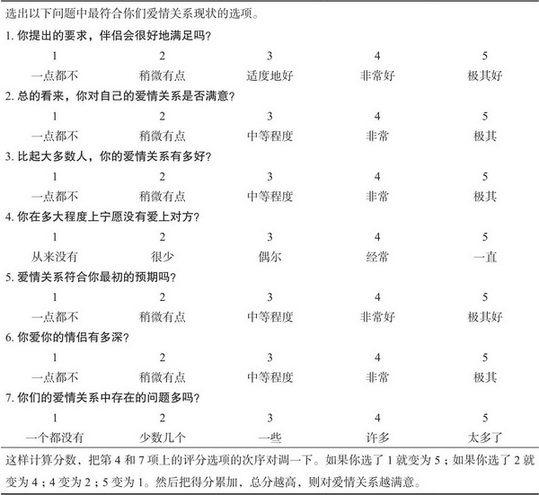

[toc]

# 第2章 研究方法

- 在人际关系方面似乎有更多一知半解、不懂装懂的所谓专业人士吸引着你的眼球。在书店里或者在网络上，充斥着指导人际关系发展的各种建议和意见，大部分所谓的专家根本就没有研究过人际关系，他们要么根据自己的个人经历得出结论，要么直接凭空虚构。如果你能辨析真实可信的科学结论和小道传播的经验之谈，就能避免不必要的精神和物质损失。而且，人际关系学中的错误信息给人们带来的伤害远大于其他科学。

## 关系科学研究简史

## 问题的提出

- 问题本身分为两大类。第一类，科学家可能尝试对某些事件或一系列事件的自然发生过程进行描述。这种情况下，科学家的目标是尽可能全面和精确地描述事件的性质。另一类是，研究者要确定事件之间的因果联系，以确定哪些事件对随后的结果有显著影响，哪些没有影响。对所有主持研究和参与关系研究的人而言，这种区分具有重要的意义。第一，不同的研究具有不同的目的，有辨别力的读者应该判断出这些研究的原本目的。如果某项探索性研究主要是为了描述新发现的现象，我们不应因为它确定不了该现象的因果联系而去苛评，这些是第二步才能解决的问题，首先需要确定出现的现象是什么。第二，更加重要的是，有思想的读者要抵制诱惑，不要试图从以描述为目的的研究中得出因果联系。只有某些特定的研究设计才能让我们洞察事件之间的因果联系，聪明的读者不要匆忙得出研究结果并不支持的虚假结论。

## 参与者的选取

## 研究的设计

### 相关设计

- 相关只告诉我们两个事物之间存在联系，但是它并没有告诉我们为什么它们会相关。相关并不能表明事件之间存在因果联系。当你得出相关结论时，当心不要推导出其他没有根据的结果，相关只是相关；相关的存在意味着可能有很多不同的似是而非的因果关联。

### 实验设计

- 考察因果关系

### 发展性研究设计

- 考察样本的长跨度时间的变化。或回溯样本对象的以前的人生经历

## 场景的选择

- 实验室
  - 方便控制变量
- 家庭日常环境
  - 方便观察人们的日常行为

## 数据的性质

### 自我报告

- 表2.2　爱情关系评价量表
- 
- 问题是参与者可能对问题的理解有偏差
- 参与者回忆困难
- 参与者可能撒谎，存在偏差或歪曲

### 观察法

- 直接观察行为

### 生理测量

- 记录人们的身体状态变化
- 比如，研究发现亲密的爱情和饥渴的性欲由大脑不同部分控制

### 档案资料

- 根据历史档案研究

## 研究应遵循的道德规范

- 需要思考调查他人的私生活是否符合道德规范
- 有时需要伴侣模拟某些场景，比如，假设你们争吵，或回忆上一次争吵并再现，可能会影响亲密关系。是否符合道德规范

## 结果的解释和整合

## 最后要点

- 人们喜欢轻松容易的答案，喜欢简单干脆的信息。如果科学事实难于掌握，很多人实际上更喜欢简单的谬论，如“男人来自火星、女人来自金星”这样的观点。然而，作为刚刚接触人际关系科学的读者，你有义务崇尚事实，反对迷信，即使弄清人际关系的复杂性要颇费一番周折。勿将科学的谨慎误解为缺陷。相反，我们希望你持有这样一种信念，恰恰是这种谨慎体现了科学的尊严，使人们能坦率地面对本领域的优势和不足。那些声称自己一直正确的人，毫无疑问是招摇过市的江湖骗子，谨慎的科学家不会这样做，他们只会努力使自己不断接近真理。