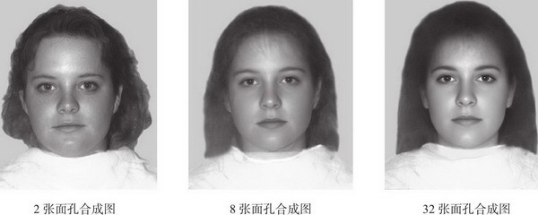

[toc]

# 第3章 吸引力

## 吸引力的基础：一种奖赏

- 人与人之间的吸引力最基本的假设是：他人的出现对于我们有奖赏意义。
  - 直接奖赏：他人提供给我们显而易见的愉悦，给予我们很多乐趣和赞许，我们会对这种关注和接纳感到高兴
  - 间接利益：他人聪明又美丽，享受这些赏心悦目的个人特征
  - 多数情况下，人们提供的直接奖赏越多，对我们的吸引力越强

## 临近：喜欢身边的人

- 能够听见朋友的声音，看见微笑，真实的握手更具有奖赏价值。现实的临近首先决定了是否相遇。多数情况下，友谊和爱情都源自与身边人的交往
- 回想一下：新学期开始你认识谁？谁是你的好朋友？你最喜欢的人是谁？
- 书中列举的实验验证，略。

### 方便：远亲不如近邻

- 为什么空间上的临近有这么大的影响？
  - 首先，我们容易得到他们提供的奖赏，奖赏的价值更高，而付出的代价更少。文字和声音表达的爱意远不如真实的一吻打动人。因而，分居两地的亲密关系一般不如朝夕相伴的亲密关系令人满意

### 熟识：重复接触

- 曝光效应：重复接触他人（甚至只是看他人照片）通常就能增加我们对他们的喜欢程度。即使我们没有和他们有过任何交流。

### 临近的作用

- 临近能增强我们的情感：会对喜欢的人更喜欢，厌烦的人更厌烦

## 长相吸引力：喜欢那些可爱的人

### 对美丽的偏见：“美的就是好的”

- 人们受到“美的就是好的”这一简单刻板印象的影响：人们认为美丽的人就有着令人满意的特质。而且我们似乎自动判断，没有意识的思考，看到美丽面孔就做出正面评价。
- 人们根据美丽面孔而赋予其何种正面评价取决于人们的文化强调的价值观：比如集体主义文化下的人们认为美丽的人非常关心他人，而个人主义文化下的人们不会这样。
- 对美丽的偏见容易混淆了容貌和才能。貌美之人一般工资更高，晋升更快。平均而言，貌美的雇员比中等相貌的人多挣5%，而丑陋的人少挣9%。不论你有多聪明，相貌仍然对收入有影响
- 对美貌的偏见还体现在大学生评价教师，政治选举甚至法庭罚款多少等许多方面

### 吸引力的秘密

- 研究发现参与者对谁漂亮谁不漂亮有相同的看法，这一共识跨越种族，肤色。就算新生儿也会盯住漂亮面孔更长时间，而不是不漂亮的面孔。
- 漂亮面孔的女性特征：大眼睛，小鼻子，尖下巴，丰满嘴唇，青春可人有女人味而不是孩子气。这些特征是全世界公认的
- 漂亮面孔的男性特征：比较复杂。有结实的下颚和宽阔的前额看上去坚强和有主宰力。同时用电脑改变男性面孔为稍微的娃娃脸看上去更热情友好，也有吸引力。
- 值得一提的是，女性喜欢哪种男性脸型取决于她们的月经周期，排卵前的受孕期会觉得不修边幅，具有男子特征的面孔吸引人，其他时间则喜欢青春型，孩子气的男性面孔
- 任何情况下，漂亮面孔都是处在平均水平，有大量人脸进行平均合成的人脸比单个面孔更有吸引力。即鼻子不大不小，眼睛不大不小，面孔两半互为镜像。而不是指平庸的长相吸引人。 即使是双胞胎，我们也会发现，更对称脸型的那个人更漂亮。
- 
- 不同体型的吸引力差异：男性认为体重正常，不胖不瘦，腰身明显细于臀部的女性身材最优诱惑力。最吸引人的腰臀比是0.7。肥胖不如身材苗条或者正常的身材有吸引力，但干瘦并不比正常更有吸引力。男性喜欢丰满的乳房，但乳房的大小不如身体的比例重要。曲线比率0.75的腰胸比例最吸引男性。同时，腰臀比比乳房大小更能影响男性对女性吸引力的判断。
- 对于男性来说，当腰部仅比臀部略窄，为0.9时最有吸引力，宽广的肩膀，肩臀比例大（约为1.2），肌肉强壮的男性发生性关系的年龄更早，性伴侣更多，全世界都一样。然而，男性只有好身材还不能吸引女性，除非他还有其他资源：只有他有体面的薪水时，他的腰臀比例才能影响女性对他的评价。
- 男女双方都倾向于男生高于女生。网络上高个子男性比矮个子更容易得到回应。如162厘米的男性想在婚恋网站上得到与186厘米的男性一样多的回应，需要赚更多的前，且这个数字是每年221000美元。职场中高个子获得更多尊重，更高收入。不考虑性别，在英美身高增加一厘米平均每年多挣789美元。在各种职业中，身高185的人比175的人多挣3156美元
- 面孔对称 有吸引力的人的气味比面孔不对称，没有吸引力的人的好闻。因为研究发现，陌生人偏好俊美之人的体味。男性认为女性在排卵期的体味比月经周期的其他时间好闻。
- 长发女性比短发女性对男性更有吸引力
- 女性更喜欢胸部光滑少毛而男性
- 女性更喜欢聪明的男性。原因可能是他会用比平常谈话更华丽的词藻
- 最后，男女两性都认为穿红色衣服约会的对象更有吸引力。当女性穿红色衣服时，男性更愿意采取示爱行动，如请求约会或话费金钱

### 长相吸引力的演化观

- 有对称脸型的人往往也有对称体型，身体生理更健康，有对称体型的妇女体内雌二醇的含量更高可能更有生殖能力。拥有对称体征的男女更加聪明，更少生病
- 荷尔蒙通过调节脂肪分布影响腰臀比例，腰臀比例接近0.7的妇女带有特定比例的雌二醇和黄体酮的混合激素。更容易受孕，更健康。男性腰臀比例0.9更健康。而且腰臀比例低的妇女的子女在认知测验中表现更好
- 在恶劣地区，美貌代表健康。
- 年轻女性更可能留长头发且质量更好。也与健康有关
- 女性在排卵前几天才有可能受孕。这段时间女性发现男人的某些特征更有吸引力。这段时间女性更爱男子气的面孔，低沉的嗓音，对称体型男子的体味以及更大胆傲慢有领袖魅力的行为。更被自信果断，狂妄自大的男性吸引。其他时间喜欢含情脉脉，和善友好，谦虚保守的男子。
- 妇女在受孕期更有吸引力，穿红色衣服，装扮妖娆性感，露出更多肌肤，变得风情万种。更愿意接受陌生人邀请跳舞，对性关系更感兴趣。当男子闻受孕期女子穿的T恤时会粉笔更多的睾丸激素，脑子浮现性相关想法

### 文化也起作用

- 经济困难时期更爱丰满女子，经济繁荣时期社会则期望女性更瘦。
- 不同种族的审美差异。美国的黑人和拉丁裔更喜欢稍胖的女性（但是他们都爱0.7的腰臀比，这一身材对所有男性都有吸引力，事实上，文艺复兴时期绘画中的女性腰臀比都是0.7）
- 综上，不见得情人眼里出西施，世界各地对美丑判断标准是有相当一致性的

### 长相的重要性

- 对于短暂见面后做出是否继续接触的决定（快速约会）取决于长相。大部分人3秒钟就做出决定了
- 外向友善的人更受人喜爱，但是在短暂见面中，一切都不如外貌重要
- 外貌吸引力或许是影响男女之间最初喜欢彼此的最重要因素

### 美丽：交织着的代价与收益

- 长相对男性的影响超过长相对女性的影响
- 有吸引力的人更受欢迎，不怎么孤独，拥有更好的社交技能，比其他人更快乐，如果愿意还可以和更多人发生性关系，还影响人们一生的适应能力和幸福生活变量的10%
- 有吸引力的不利之处：人们对俊美之人更可能撒谎，比如虚报身高收入兴趣等，但是对其他人则不虚构形象。因此俊美之人常常认为别人在拍马屁，奉承自己，并谨慎怀疑他人，对他人的赞美打折
- 研究发现，俊美的人认为不了解他们长相的人的赞美更可信，长相平庸的人认为了解他们长相的人的赞美可信，但是可悲的是，他们并不习惯来自了解他们长相的人的赞扬。
- 所以，俊美之人更能和人愉快交往，但是不那么信任他人。
- 长相的吸引力取决于居住环境，人口稠密的城市里看重长相，但是在农村地区则不太重要

### 长相吸引力的匹配

- 确定爱情关系的伴侣，双方的长相吸引力往往也是类似的，这种现象叫匹配
- 亲密关系越严肃，投入程度越多，匹配越明显。不匹配的恋爱关系是不稳定的。这表明，虽然每个人都希望自己的伴侣长相俊美，但是只有那些容貌也俊美的人才能得愿以偿。
- 虽然很不浪漫，但是相似的长相或许是筛选伴侣的一个指标。
- 在婚姻中长相吸引力起的作用不如当初把情侣们吸引在一起的时候那么重要，但如果两个人差异很大，亲密关系可能根本无法建立

## 礼尚往来：喜欢那些喜欢我们的人

- 当我们寻找未来伴侣时，大多数人用下面公式衡量自己对他人的实际兴趣以及接近伴侣和建立亲密关系的可能性：对未来伴侣的期望=伴侣的外表吸引力*伴侣接纳自己的可能性
- 最吸引人的伴侣是长相过得去，也很有可能接纳我们的人
- 害羞或低自尊的人往往紧张不安的估计他人会拒绝自己，因而追求不太出众的对象。当我们不太确定他人是否接纳我们的时候，大多数人都不愿意去冒被拒绝的风险
- 人们更可能与那些愿意接纳而不是拒绝他们的人接近，但是最好的接纳来自那些挑剔讲究的人，而不是来者不拒的人。只有对少数人表现出兴趣的人才更有吸引力。
- 一味地故作清高没什么用，真正有用的是有选择性的故作清高，也就是除了你想吸引的人之外，其他人得到你都是可望而不可即的。那些能付出代价拒绝大多数人却又能高兴的接纳我们的人才是最有吸引力的伴侣
- 喜欢那些喜欢我们的人这一倾向与吸引力的奖赏模型是一样的。这一倾向还复合平衡理论，该理论认为人们期望他们的思想，感情，社交关系能够保持一致。如果双方互相喜欢那就是平衡。反之就是不平衡。
- 我们倾向于喜欢与我们态度一致的人，如果我们获悉某人和我们一样厌恶他人，我们就倾向于喜欢这个人。这就是常常说的，敌人的敌人是我们的朋友

## 相似性：喜欢与我们相像的人

### 有吸引力的相像种类

- 相像的种类
  - 首先是年龄，性别，种族，宗教，教育程度和社会地位等人口统计学上的相似
  - 其次是态度和价值观的相似
  - 最后是相似的性格，处事风格和人格特质

### 相异并不相吸

- 某些杂质宣传年龄相差很大的伴侣结婚。其实他们或许有着不同的优势，在人际市场上都在寻找与自己身价整体相当的伴侣。
- 这也许并不浪漫，但是名望，财富，健康，才能和长相等等就像商品能吸引心仪的伴侣。如果我们把匹配视为广泛的过程，不仅仅涉及长相吸引力，那么显然人们会与旗鼓相当的人配成一对。这就是同性相吸而不是异性相似。
- 男性比较注重年轻漂亮，因为更可能成功繁衍下一代，因为女性绝经后就不能生育了，漂亮可能在于它与健康有关联。
- 女性不必关心伴侣是否年轻，因为男性活着就有生殖能力。相反，更看重养育后代耗费的巨大投入，她们要找一个能在漫长哺乳期为她们遮风挡雨，保护安全的伴侣，偏爱拥有丰富资源，社会地位高的强势男性。挥金如土的男人比吝啬的男人更能吸引性感的伴侣。女性对伴侣年龄的偏爱不会随着年龄增加而变化，女人终其一生都喜欢嫁给比自己大几岁的男人。而男人随着年龄增长，与他们结婚的女性的年龄与他们相差越大
- 人们认为相异相吸的原因在于这样一个事实：人们需要一段时间来了解彼此共同点与差异。可能在刚见面的时候取决于长相吸引力，我们希望俊美之人与我们有相同的态度和价值观，但是并不是这样。
- 根据刺激——价值观——角色理论，我们会从伴侣那里获得三种不同的信息，它们影响了亲密关系的发展。
  - 第一次相遇，彼此吸引力建立在刺激信息基础上，包括年龄性别长相等外部特征。
  - 随后进入价值观阶段，吸引力取决于彼此态度和信念相像程度。
  - 角色相容性变得重要。此时伴侣发现他们在养育方式，事业，居家等基本生活要务上是否一致。问题是这些问题需要在婚后才能凸显出来。
- 我们很少真正的如自己认为那般了解伴侣，他们过高估计彼此相像程度。但是自认为的相像程度与关系满意度的相关高于真实相像程度与关系满意度之间的相关。在某种程度上，人们似乎是和幻想中的伴侣结婚——他们爱上的是另一种人，却认为自己的伴侣就是这种人。
- 就自认为的相像来说，这种错觉能解释相异看上去也能相吸。自认为的相像会把人们聚在一起，至少能维持一段时间，即使他们之间的差异在旁观者眼里很明显
- 人们仰慕有能力有才华的人，这些特质是自己渴望并没有的。相像起作用的一个微妙之处在于，那些我们渴望成为的人对我们有吸引力。但是，如果那些人超过了我们理想中的自我，让我们相形见绌，就具有威胁意义和令人不快了。
- 相异并不相吸，但是某些差异会在逐渐消退，并且久而久之，新发现的相像会有助于伴侣在一起，即使他们最初的共同点并不多。
- 某些相像（相异）十分重要，其他一些可能无关痛痒。
- 家务和性别角色是属于有影响力的那种相像，同居的情侣如果对家务劳动分派有分歧，那么他们更可能分手，共同分担家务的夫妻更满足。性别角色相像的夫妻比相差很大的夫妻更幸福。具体而言，和性别角色更为相像的配偶比起来，大男子主义和小女人味十足的妻子彼此理解更少，情义更少，爱恋和满足也越来越少。
- 感到最多爱意和最少冲突的伴侣时那些在热情上相似而支配欲不同的伴侣。如果一方在亲密关系中带头，另一方愿意顺从时才最快乐。

## 障碍：得不到的就喜欢

- 最后一个影响吸引力的因素是人们努力克服障碍以实现愿望的倾向。如果我们面临失去某种事物的危险时，我们可能反而想得到更多。
- 罗密欧与朱丽叶效应：父母越干涉子女恋爱自由，他们彼此越相爱

## 男女两性期望的理想伴侣

- 如果可以选择，大多数人期望伴侣有以下特点：
  - 热情忠诚 值得信赖 亲切友善 给予支持 善解人意
  - 吸引力和活力 长相俊美 性感 外向
  - 社会地位和资源 经济宽裕 生活安心
- 女性挑选短期情人：
  - 强壮肌肉
  - 性感
  - 能引起性激动
- 女性挑选丈夫：
  - 良好品格而非英俊外表
  - 看重热情 忠诚 社会地位和经济资源而不是长相吸引力和活力
  - 威望和成就比勇敢强势更重要
  - 如果不能拥有全部特质，则女性更喜欢友善 体谅和富裕（不要求特别英俊）的男子
- 男性在长期亲密关系中更看重吸引力和活力。更喜欢没什么金钱，友善漂亮的女子，而不是有钱但爱抱怨或温柔但丑陋的女子
- 男人往往首先确保女友至少有普通的长相，然后再来寻找尽可能多的热情 友善 诚实 坦率 稳定 幽默 智慧等特征。绝世容颜是男人渴求的，但是不如高水平的热情和忠诚重要。
- 女人首先确保男友至少有点金钱和前途，然后再来寻找尽可能多的热情友善城市坦率稳定幽默智慧等特征。金钱和财富是女人渴求的，但是不如高水平的热情和忠诚重要，长相排第三。
- 综上所述，男人专注于长相，女人专注于资源，但是人人似乎都期望伴侣友善 随和 可爱和亲切，男女没什么差别。只要女伴姿色中等，只要男伴金钱足够，两性都想尽可能得到更多热情和忠诚。