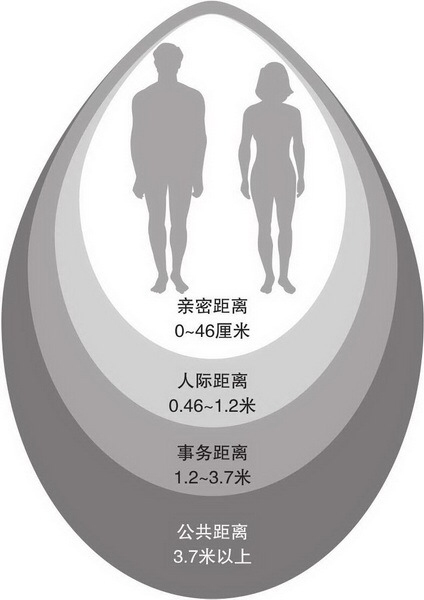
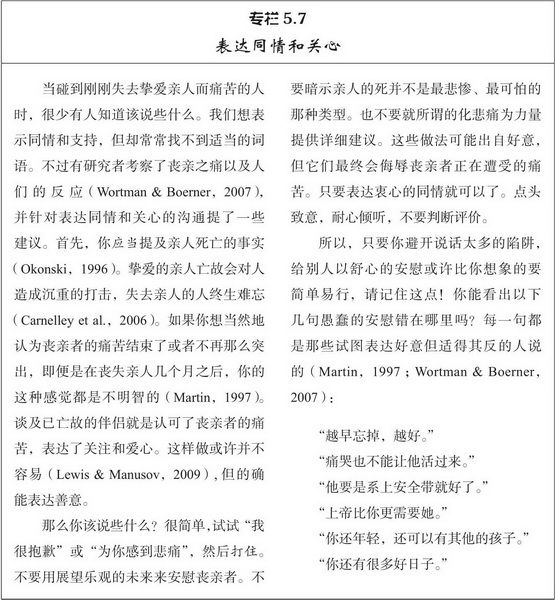

[toc]

# 第5章 沟通

- 我们不会想到伴侣也会误解自己，故而不像和陌生人相处那样努力检查彼此是否达到共识
- 人际隔阂（即表达方和理解方可能表达和理解的是不同的意思）令人沮丧，不仅与亲密关系中的不满有关，而且会妨碍有奖赏价值的亲密关系的建立

## 非言语沟通

- 非言语沟通的三种功能
  1. 提供信息。提示人们的情绪状态和所说话的意图
  2. 调控交往。非言语行为表露兴趣，在开始时就决定沟通能否进行下去，之后人们还能根据微妙的非言语线索你来我往的进行谈话，从而整个沟通过程流畅持续下去
  3. 表达亲密，传递权利和地位信号。关系亲密与一般熟人的非言语行为不一样，地位高的人和下属的行为也不一样。

### 非言语沟通的组成

- 面部表情

- 注视行为

- 身体动作

- 身体接触

  > 当两人关系变得更加亲密时，彼此身体的接触也会增多，这是好事。充满爱意的身体接触有益于我们的健康，经常与伴侣接吻能降低胆固醇，一周进行三次3次30分钟的头部和颈部按摩可以降低你的血压和应激荷尔蒙的分泌。身体接触显然能传递亲密和关爱，同时具有保健功效。

- 人际距离

  - 无论人们的偏好怎样，人际距离都是测定人际交往亲密程度的巧妙手段，甚至能用来间接测量人际关系的质量：不幸福的配偶比满意的配偶保持的人际距离更大
  - 

- 副语言

  - 指的是言语过程中除词语外，个体发出的声音特征，如节奏，音调，音量，速度。
  - 根据副语言可以确定人际关系的性质，因为情人之间和朋友之间彼此谈话的节奏并不一样，情人之间延迟应答的时间更长，谈话间常有沉默，总体说的更少。即使面对陌生人，人们面对俊美之人，会使用更低频的声音，而且这样做他们感觉更愉悦。
  - 如果你倾听女性在月经周期不同时间录制的磁带，录音内容只是从1开始数数。你会发现女性在排卵期前几天的声音听起来更吸引人，这可能是女性荷尔蒙的变化对其声带造成的影响

- 各部分的结合

  - 如果交谈双方采取相似的姿势和风格，表现出相似的表情，使用类似的副语言，就可能出现了无意识的行为模仿，这可能涉及上述的所有部分。如果人们交往轻松愉快，往往会自动使他们的非言语行为保持同步，根本无需思考。比如一方用手抓了一个鼻子，另一方可能也会这么做。一旦出现这种情况，交往常常非常顺利，更喜欢彼此，即使他们并没有注意到这种模仿
  - 如果出现了非言语模仿，显然我们会感到高兴和舒心，而反之我们的互动会非常紧张

### 非语言沟通的敏感性

- 伴侣们运用非言语沟通的敏感性和准确度能预测他们的亲密关系的幸福程度。非言语沟通不良的夫妻往往对婚姻不太满意，而且如果出现了这种问题，一般都是丈夫的过错
- 研究表示：如果非言语交流失败，那可能是表达或理解出现问题，表达者传递了令人混淆的信息或理解者没有正确解释接受的信息。女性往往在两个方面都有优势。
- 不幸福的丈夫传递了更多的混淆的信息，也发生更多的理解错误。所以才得到这个结论。处在婚姻困境中的丈夫竟然会误解妻子传递出的连陌生人都能清晰解读的信息，糟糕的是，他们竟然一无所知，还以为自己的沟通很到位，认为是互相理解的。
- 但是沟通不良并不全是丈夫的过错，在另一个研究中发现，在不幸福的婚姻中，夫妻双方都能更好的理解陌生人，却不能很好理解彼此。显然他们有能力进行非言语交流，但是彼此之间却存在沟通不良
- 为什么女性在非言语沟通上表现比男性好？技能和动机似乎都有作用，平均而言，女性拥有更好的非言语才能，更致力于沟通任务。如果男性也更注意理解他人，他们的成绩会改善，但是还是不如女性。这里有个小技巧：看别人的眼睛。女性比男性更多时间的看别人眼睛，这似乎是她们能准确解读他人表情的原因。
- 如果男女双反都仔细看 耐心听 用心思索 他们在非言语沟通上都能做的很好，并且我们通常更娴熟的解读亲密伴侣的非言语线索，而不是其他人的。但是，如果伴侣的一方对非言语行为漫不经心，就可能比那些更专注的配偶产生更多误解，幸福感和满意度都更低

## 言语沟通

### 自我表露

- 向他人透露个人信息就是自我表露。它是亲密程度的指标之一：如果彼此之间不共同拥有一些私人信息，他们的关系就称不上亲密
- 人际关系刚刚建立时，自我表露可能是个又窄（讨论话题少）又浅（透露不带个人色彩的信息）的形状，随着人际关系发展，这个形状会变深变宽。
- 
- 自我表露会有相互作用，对方表露多，自己也表露多。但是刚认识就说太多就会给别人不好的印象
- 两人变得亲近必须满足三个条件：
  1. 进行有意义的自我表露
  2. 对彼此信息有兴趣和同理心，男性这样做更有意义
  3. 双方必须认识到另一方的应答，判断伴侣的理解和关爱
- 亲密的自我表露和选择性的保留一些秘密都能促进婚姻美满。 
- 当然保留一些秘密并不总是那么轻松，特别是在亲密关系中，要成功保守秘密往往需要努力，也有一定关系受损的风险。人们这样做的可能理由：保护自己，保护他人，保护关系。
- 伴侣之间会有一些禁忌话题，这些敏感问题可能会影响亲密关系质量。最常见的问题就是亲密关系本身的状态。如爱情的现状及未来，其他伴侣的状况，过去的亲密关系，过去的性经历等。
- 但是人们对这些问题很感兴趣，只是不会明问。相反，他们会进行秘密测试：
  - 观察伴侣对其他有吸引力的异性的反映（三角测试）
  - 制造困难来让伴侣克服，检验忠贞（耐力测试）
  - 暂时分开后观察恋人欢迎自己回来的热忱（分离测试）
- 这一切好像是自寻烦恼，因为直接询问就能知道，但是他们不会讨论。的确，这样做会给彼此带来紧张感。
- 总的来说，禁忌越多，满意度越低。而有礼貌的一起努力维持伴侣关系没有什么不好影响
- 幸福的爱人的谈话方式与不亲密的伴侣不同。他们会用双方明了的独特暗语和比喻。他们用口头禅，特定词汇或惯用语，他们使用的惯用语越多，就越幸福美满。
- 自我表露与喜爱相关的因素很多：
  1. 我们倾向于向自己喜欢的人透露信息，其他条件相同，对他人越开放，我们越喜欢他们。
  2. 别人信任我们对我们有奖赏意义。表露多的人更招人喜爱。
- 所以得到和给予自我表露都让人感觉良好
- 最后，自我表露有益于身心健康。自我表露的人对生活更满意。诚实表达关心 钟爱 温情 呵护对于他人是巨大的奖赏，心中光有爱还不行，还必须清楚的表达出来

### 言语沟通中的性别差异

- 男性和女性并非说的不同语言，只不过有时谈论事情不一样罢了
- 谈话主题
  - 女性之间谈话倾向于情感问题，生活私人问题
  - 男性之间倾向于不带个人色彩，客观的活动，比如名人和政治任务。找乐子而非支持和忠告
  - 但是男女之间互动时，这些差异非常小
- 谈话风格
  - 女性说话有时不如男性强硬，她们更间接，用模棱两可的话缓和主张，询问而不是直接提要求
  - 但是事实证明，女性只有在和男性讨论男性话题的时候才更具有试探性。
  - 男性在和女性讨论女性话题时比女性更有试探性
  - 所以，不存在谈话风格差异
  - 刻板印象认为女性更爱说话，男性不如女性畅所欲言，抒发观点。但是男性一旦说话就滔滔不绝，容不得打断。女性虽然说话多，但是很少做成篇独白式的演讲
  - 男女之间不存在巨大的整体差异，但是存在用词的个体差异。高神经质的人（情绪不稳定）比乐观的人更多使用“可怕”“糟糕”“恐怖”“烦人”这类的词语。“喝酒”“跳舞”表示性格外向。“拜访”“一起”“拥抱”和宜人性有关。
  - 两人用词相似更可能彼此吸引
- 自我表露：**不像前两个，在这点上存在较大性别差异**
  - 男性对女性伙伴的自我表露一般多于对同性朋友的自我表露——男性与女性的人际交往可能更亲密，有意义。这造成的后果是，男性常常依赖从女性那里获得的温情和亲密，但是女性很少依赖男性，女性和同性之间也能有亲密的 开放性的和支持性的联系。因而，男性一生中或许需要与女性交往来避免孤独，但是女性并不需要男性。
- 工具性对表达性
  - 大男子主义常常把男性朋友拒之千里之外，如果没有浪漫的爱情，就往往感到孤独痛苦。与此相反，双性化的男性（既自信果敢又热情外向）能很轻松的向男性和女性进行自我表露，从而体验到乐趣，结果他们不会感到孤独，他们会花费更多的时间与女性交往
  - 有些人把思想和情感组织为文字的速度很快，但是有些人很慢，这叫做交谈反应性的差异。交谈反应性高的女性和沉默寡言的男性刚见面可能愉快相处——因为女性一直说话，男性不用说话。但是想一起生活就有点危险。因为发生冲突时，女性会主导过程，这种模式违反了一般的男人是一家之主的社会期望，这种模式对双性化男人造成的麻烦很少，但是大男子主义的人很不满意。

## 沟通障碍及其应对

- **这一部分，涉及到了《非暴力沟通》的主要内容和《爱的博弈》的部分观点与方法**

### 沟通不良

- 首先，不幸福的伴侣在表达意图上表现很糟糕。如果他们抱怨某事，很少准确表达，而总是和其他抱怨一起说出来，即同时说好几个问题。这就让他们本应该最关注的事情被淹没。因而，他们的谈话经常偏离主题，从一个问题转移到另一个问题，以致于不能在一个问题上维持足够时间：“我说的你从来不会做。你和你妈一样顽固，你老是站在她那边。”在一长串关心的问题上扯来扯去，结果就是一个都解决不了。
- 其次，不幸福的伴侣在彼此倾听方面表现很糟糕，他们很少耐心仔细思索伴侣所说的话，反而仓促得出结论，并根据自己的揣测立即做出行为。表现之一就是读心术，即人们想当然的认为无需询问就能理解伴侣的思想，情感和观点。所有亲密伴侣都会表现出某种程度的读心，但苦恼的伴侣却以恶意的方式读心。中性或善意的动机被他们解读为居心不良（“他这样做，就是对昨天那件事的报复”）。不幸福的伴侣比幸福的伴侣更多的以消极方式打断对方谈话。为了表示赞同或者要求解释而打断，并不会影响沟通，但是打断是为了转移话题或表示反对意见，那就可能会显得不尊重或不欣赏伴侣
- 苦恼的伴侣总是能在对方的话中找到错误。总是使用“不过”这个句式。不断表达对伴侣观点的批评：“是的，我们可以试试，不过这并不可行，因为……”不幸福的伴侣还会进行反向抱怨，避开对方关注的问题，只用自己的抱怨来回应伴侣的抱怨，而不是对伴侣的话表示关注。
- 最后，不幸福的伴侣在交谈时常常表现出消极情感。他们常常对伴侣的抱怨报以讽刺挖苦，贬低和鄙视伴侣的人格。这类有破坏性的交往通常以批评开场，攻击伴侣的人格和品德，而不是就事论事。伴侣通常反映是自我防卫，通常反向抱怨，寻找借口，激烈反攻。接下来伴侣可能出现拒绝回答问题或者拒绝合作的心理石墙。但是伴侣没有反应更令人生气，最终可能出现毁灭性的交战状态。
- 研究者只要观察婚姻冲突录像的开头3分钟就能以高达83%的正确率预测哪对夫妻会在6年后离婚。婚姻注定失败的夫妻表现出更多的蔑视，防卫和交战状态。而沟通良好的夫妻更加幸福美满。

---

下面是避免沟通陷阱需要做的几点

### 精确表述

- 尽可能清除明白，详细具体的指出惹怒我们的特定行为沟通就会变得明智 准确。这种方法就是描述，这样不仅告诉伴侣自己的想法，还能把重点放在可处理的，单独的某个行为上。正确的行为描述指的是某个特定事件，而不涉及普遍性。所以，我们不应该使用“总是”和“从不”这样的词。“你总是打断我，从不让我把话说完。”这就是错误的描述
- 我们尽量使用第一人称陈述来明确自己感受。即用“我”开头，这能驱使我们辨识自己情感，而不是把关注都放在伴侣身上。应该说“我现在感到非常生气”而不是“你真的惹怒我了。”
- 两者结合的简单方法就是使用一个特定句型，“当你在某情景下做某事时，（行为描述）我感到什么（第一人称陈述）”
- 

### 积极倾听

- 在沟通中当我们接受他人信息时，有两个方式要完成。第一是准确理解对方话语的意思，第二就是表达关注和理解。这两个任务都可以通过复述接受到的信息完成。即用自己的话重复对方的意思。人们在谈话中用这个技巧时，并不想当然的认为自己理解了对方的意思并立即回复。这看起来使得沟通不流畅，但是它确实是避免争吵冲突的好方法。不这样做就容易引起误解和错误。无论谈话在什么时候变得过激，复述都可以使之免于失控。

### 守礼而镇定

- 研究者发现，一旦愤怒，人们根本想不到这些技巧，当处在痛恨伴侣，想要报复的心理状态时，做出第一人称陈述甚至根本不可能。因而，再被激怒的情况下保持清醒，在开始生气时冷静下来，都是可贵的技能。
- 你或许愿意和伴侣定期会谈，双方礼貌的表达各自不满，如果你知道伴侣会设法解决问题，你在会谈的其他时间就能愉快的和伴侣相处
- 在任何情况下，双方都不应该彼此来回反复侮辱讥讽。如果你发现你处在这种消极情感相互作用的状况，可以暂停一下这种恶性循环。要求休息片刻，等你不那么激动时再来讨论刚才的问题。最多做6分钟的深呼吸，你就能平静下来。

### 尊重和确认的力量

- 良好的沟通包括很多因素，最关键的要素就是明确表现我们对伴侣观点的关心和尊重。
- 对伴侣的确认，承认他们观点的合理性，表达对它们立场的尊重，一直是亲密交往中值得拥有的目标。 
- 确认并不需要你一定和伴侣观点一致，即使不一致，你也能对其观点表示适当尊重和认可。考虑三种回应方式
  - 我讨厌你那样做
  - 我讨厌你和某某某喝醉酒（反向抱怨）
  - 好吧，你说得对，我以后不会了（赞同）
  - 是的，我明白你的感受，你的话有道理，但我希望你也能理解我的感受（认可）
- 只有最后一个回应既承认了对方观点又表达了自己的情感，从而开启坦诚平等的对话。而不需要虚假或谦卑的屈从伴侣的意见。
- 通过练习这些技能，并保证即使出现困难也要彼此保持礼貌和尊重，你甚至能让陷入绝境的亲密关系起死回生。