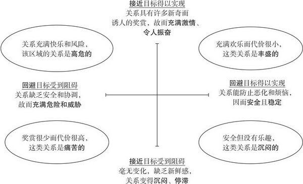
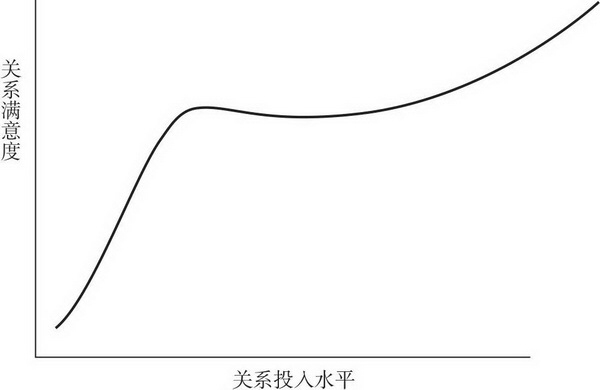
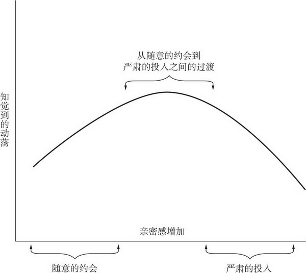
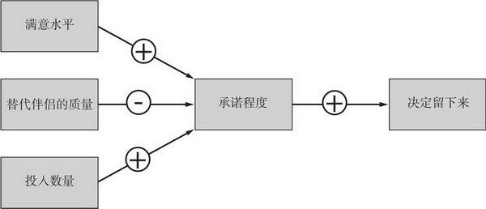

[toc]

# 第6章 相互依赖

- 我们会仔细考虑人际交往收支平衡表中的盈亏，你或许没有想过要做一名核算人际交往的会计师，但这样做可以深刻的洞察亲密关系的运作过程

## 社会交换

- 亲密关系中的伴侣双方都必须满足自己的利益，否则亲密关系不可能持续下去。
- 相互依赖理论是人际关系学家使用最多的理论。先来看社会交换的核心要素。

### 奖赏和代价

- 我们用奖赏这个词来泛指人际交往中任何值得拥有和受人欢迎的事物，这能够给接受者带来愉悦感和成就感。与之相反，代价是有惩罚性的，包括金钱支出，心理负担，对亲密关系发展的不确定性的担忧，对伴侣的缺点感到的沮丧和不得不放弃某些事物而感到的遗憾。
- 某一特定人际关系所带来的奖赏和代价之差就是结果
- 相互依赖理论的一个观点认为，人际交往的结果是正是负不重要，重要的是我们的两个标准，第一个是我们的期望，第二个是假如我们没有现在的伴侣，我们认为自己会过得怎么样。

### 人际关系的期望收益

- 每个人都有一个不同的比较水平（CL），即我们认为自己在与他人的交往中应当得到的结果值。CL值建立在过去经验的基础上。如果交往结果超出了你的CL，你会感到幸福，幸福程度取决于得到结果超出期望的程度。但是如果低于CL，即使结果很好，但是你仍不幸福
- 满意度=结果 - CL

### 人际关系的替代收益

- 满意度并不是唯一的，甚至也不是决定亲密关系持续与否的最主要因素，我们会用到第二个标准，即替代的比较水平（CLalt）来确定我们在其他关系中是否会更好。如果我们抛弃现在的亲密关系，而转投其他更好伴侣或情景所能得到的最好结果
- 因为我们会追求更大收益。同时，如果我们在更好的替代选择出现之前并不会脱离现在的亲密关系
- CLalt值决定了我们对亲密关系的依赖程度，不管我们满意与否，如果我们认为现在的亲密关系是我们目前能得到最好的亲密关系，我们就会依赖现在的伴侣，而不会离开。而且，我们当前的结果与更糟的替代结果差距越大，依赖程度就越深。
- 个体对现有亲密关系的投入，即亲密关系结束时个体会失去的事物，也是决定个体是否维持关系的重要因素，亲密关系结束时个体失去的投入既包括物品，也有无形的心理收益，如姻亲和朋友的尊重等
- 个体的CLalt是主观认识的产物，有一系列因素影响了对它的认知。自尊就是其中之一。习得性无助也有影响力（过去的亲密关系）。信息的获取也影响个体的CLalt（见多识广的人比较高）
- 如果你对目前的伴侣很满意，你或许不会太多注意到那些对你亲密伴侣具有竞争力的对手，实际上，只有对现有关系满意的人并没有兴趣寻找其他伴侣，CLalt更低。
- 依赖度 = 结果 - CLalt

### 人际关系的四种类型

- 如果人们的关系结果超出CL和CLalt，他们会感到幸福，关系是稳定的，不会移情别恋。
- 如果人们的关系结果低于CL但是高于CLalt。他们不满意但是稳定，不会丢弃现在的关系
- 如果人们CLalt比关系结果高，而CL比关系结果低，也就是说，他们很满意但是有更好的替代选择，他们时幸福而不稳定的
- 如果人们的关系结果比CL和CLalt都低，两个标准谁比较高并不重要，他们的关系不幸福不稳定。持续不了多久

### 与时俱进的比较水平

- 一旦你习惯于完美伴侣，就会发现从他的娇宠溺爱中得到的愉悦比过去少。因为比较水平建立在过去经验的基础上，所以它会随着我们得到的关系结果而不断波动。当我们把好处视为理所当然，CL开始升高，我们的愉悦感就会减少。
- 文化的改变也会在增加我们的CLalt水平

## 亲密关系的经济论

- 随着时间推移，伴侣一方发脾气或情绪化的行为会给婚姻带来危害。直接公开的敌意就更加有害。当人们要求离婚时，往往能举出一长串不断发生的，给他们带来巨大痛苦和愤怒的事件。这些沮丧事件即使为数不多，却影响深远。因为亲密关系的负面行为比相同数量的正面行为有着更大的心理影响力。
- 要保持满意的亲密关系我们或许需要保持至少5:1的奖赏-代价比
- 我们都期望奖赏多于惩罚，93%的已婚夫妻报告做爱次数远高于争吵次数。而没有一对痛苦的夫妻是这样做的。那么为什么有如此多的不幸福的亲密关系？可能我们对奖赏的含义和价值理解存在分歧。我们彼此为对方做的一些好事，可能在对方看来并没有什么特别的。此外，可能对方只是没有注意到我们的表达爱意的行为。研究发现正面行为的发现还不到做出的四分之一。疏离型和恐惧型的人尤其观察不到。

### 奖赏的作用不同于代价

- 在处理亲密关系时我们会努力做两件事，得到奖赏，避免代价。最重要的是，它们并不相同，寻求奖赏时满足的是我们的接近动机，这种动机让我们追求快乐，是让自己感觉良好。逃避代价则是另一种动机，也就是回避动机。我们寻求避开惩罚或逃离痛苦
- 研究者认为，两者同时起作用，它们涉及不同的脑机制并且引起不同的情感和行为。有争议的结果是，愉悦和痛苦可以共存，也可以同时缺失。而且，因为愉悦和痛苦并无关联，安全可靠的亲密关系未必让人满意，令人满意的关系或许并不安全可靠。
- 垂直线是接近维度，充满正面事件的亲密关系令人兴奋而又爽快，它的负面就是令人感到空虚和死气沉沉的。这并不是痛苦，只是缺少乐趣罢了。水平线是回避维度，不论是否具有奖赏，某些亲密关系总会充满冲突危险（左边），反之就是更平稳安全，不过只是安全和没有负面结果并不意味着有乐趣
- 
- 有着较高接近动机的人一般很少有孤独感，他们感到满足，有高回避动机的人只是想避开恼人的，冒犯人和让人不安的任何人。
- 人类动机的自我延伸模型的核心思想认为，能扩展我们的兴趣，技能和经验的伴侣关系就能吸引我们。新奇的活动，新才能的发展和新思想观点的获得都有内在满足性，这就是为什么刚刚恋爱的人常常会感到快乐的原因。新建立的亲密关系通常包含有用的知识增加和能促进自我概念发展的相互关系。
- 但一旦伴侣逐渐熟悉，自我延伸就会变慢，这时许多人感到伴侣关系变得枯燥平庸。根据自我延伸模型，保持快乐的关键是创造性的发现持续你个人成长的方法，从而消除关系的沉闷。因而，在继续寻求新奇的活动和挑战之外，请思考刻意创造搞笑和娱乐新方法的价值，在日常事务中一起开心大笑。单调平庸会让亲密关系变得没有生气，而创意和新奇能消除沉闷。
- 显然，许多亲密关系不幸福的另一个原因是，在夫妻建立亲密关系的时候他们的交往还是有奖赏意义的，但是后来发生改变，的确，尽管伴侣们有着良好的意愿，但是许多亲密关系随着时间流逝而逐渐变得不太让人满意

### 与时俱变的奖赏与代价

- 在最初的幸福阶段之后，大多数亲密关系——即使那些注定会成功的亲密关系——会遭遇一个平静期，伴侣的愉悦程度在一段时间止步不前。这会令人担心，但是并不感到奇怪。根据关系紊乱模型。随着新伴侣开始习惯于他们日益增长的相互依赖，我们应该预期到会有一段混乱和调整的时期，具体来讲，随着伴侣在一起的时间越来越多，他们打断了彼此的生活常规。在刚开始投入亲密关系时也会伴随不确定性和怀疑，伴侣双方都想知道亲密关系将走向何方，未来怎样，他们越不确定，关系就可能越混乱。总之，根据紊乱模型，在亲密关系发展到中等程度的亲密度时，随着伴侣学会协调自己的需要和适应彼此，可能会出现调整和重新评价的动荡期。
- 
- 成功的亲密关系在熬过这段重新评价的时期后，就会变得更加令人满意，但是增加的速度平缓了
- 
- 随着伴侣共处时间增多，开始想知道关系前景，生活习惯也会产生摩擦，这样新建立的亲密关系的动荡和混乱也会增加，当伴侣决定严肃投入时，这一动荡达到顶峰，随着伴侣彼此调整适应了他们新的相互依赖方式，动荡随之减少
- 哪些因素能区分婚姻幸福和欢乐减少的夫妻？满意的夫妻往往具有低神经质和高自尊。即使讨论棘手问题也带着关爱和幽默，不会滋生愤怒，他们遭遇的应激源更少
- 幸福的配偶会控制器期望，CL不会太高，一般而言，抱有极高期望进入婚姻的夫妻在结婚数年后成为最不幸福的夫妻
- 相互依赖会放大冲突和摩擦，我们花大量时间与伴侣共处，依赖对方以获得独特的，宝贵的奖赏，这就意味着他们肯定会比其他任何人带给我们更大的挫败感。
- 由于缺少努力，相互依赖的放大作用，对敏感信息武器的了解，不受欢迎的意外，不现实的期望，人们通常不能维持步入婚姻时的那种亲密关系的结果，在婚姻的头几年大多数人的满意度都在下降，但是这是正常的发展过程，如果你认为你不会出现这样的问题，那么你太天真了。婚姻道路上的烦恼和麻烦比你想象的多。
- 我们认为对这些问题的深刻理解有助于人们避免不必要的失望，甚至有助于预防和避免亲密关系结果下降。如果这里的告诫是想让你形成合理期望，你对自己的亲密关系的期望就应该是乐观的。建立在敏锐见识基础上的正面展望可能使长久的满意度容易得到。
- 重要的是，如果不考虑其他方面，这一观点提醒我们始终不渝的责任， 要尽可能和蔼愉悦的对待我们的伴侣。我们期待美满的关系结果，伴侣也一样，即使他们喜欢我们，如果我们不能给予他们足够的奖赏，他们也会移情别恋。

## 亲密关系中的贪婪

### 相互依赖的实质

- 根据相互依赖理论，人们都想以最小的代价获得最大的奖赏，总是想得到最好的人际交易，每个人都是这样做的，当他们得到不错的交易时，他们会依赖伴侣。意味着使自己保持快乐与他们自己的利益有关，这样做伴侣才能继续提供这些令人期待的奖赏，如果想亲密关系继续下去，确保伴侣对你的依赖和你对伴侣的依赖程度一样，这是有利的。最直接办法就是为伴侣提供高水平的关系结果

### 交换关系与共有关系

- 交换关系中的双方不喜欢欠人情，对共同作出的贡献要分出各自的贡献，只有在认为自己有所得时才会关注对方需要，即使拒绝帮助对方也不会感到内疚
- 共有关系中，伴侣特别关注对方的幸福，彼此不期望任何回报的支持关照对方，不会严格计算自己的代价，不会希望自己的付出立即得到报答，即使没有得到好处也会关注伴侣需要，如果能帮到伴侣则自我感觉良好，人们常常为伴侣做出小牺牲，彼此帮对方大忙。结果是他们享受到更高质量的亲密关系。
- 有价值的恋爱关系都是共有的亲密关系，但是朋友也有这两个标准
- 在共有的亲密关系中不存在明显的贪婪，这是否表明我们上面提及的交换原理在这里不适用呢？完全不是，针锋相对的交换在共有的亲密关系中也有可能发生，只不过这一关系中奖赏表现出的时间更长，形式更多样化。 由于我们信任伴侣并预期关系将持续，所以我们也能等待更长时间以得到奖赏。在这个意义上来看，交换和共有的伴侣关系都是交换的关系，人们都期望自己得到的利益能配上自己的付出。
- 如果伴侣双方都美满幸福，似乎没有必要去明确计算各自的奖赏和代价
- 当出现不满意时，曾经处于共有关系的人们也会常常对关系结果的不公特别敏感。开始算计

### 公平关系

- 另一个观点认为，你不仅要表现好，你还要求公平，公平理论扩展了社会交换的理论框架，提出人们只有在成比例的公正的前提下才对亲密关系最为满意。这就意味着在亲密关系中，每个伴侣的获益与他的贡献是成比例的
- 公平并不要求伴侣双方从交往中得到相等奖赏，实际上，如果他们的贡献不同就很难公平，根据公平理论，只有在伴侣贡献较多而同时得到较多时，亲密关系才是公平的
- 如果你获益不足，你会怎样做？首先，你可以改变你（或者伴侣）的贡献或结果来恢复实际的公平。你可以要求更好的待遇以便改善结果——“该我休息了，轮到你做饭了”——或者你减少自己的贡献而希望结果保持原状。
- 公平理论最有意思的一个方面是，它明确地认为处在不公平的亲密关系中的任何人都是紧张的。我们都能理解为什么获益不足的伴侣会不快乐；他们受到了欺骗和剥削，因而会感到愤怒和憎恨。另一方面，过度获益的伴侣虽然得到很多好处，但有一定程度上会有负疚感。当然过度获益要好于获益不足，但公平理论认为，只有伴侣双方都得到公平结果时，每个人才最为满足。任何对公平关系的偏离都会引起苦恼，哪怕仅仅是因为这些情境内在的不稳定：推测起来人们会厌恶不公平，会想方设法改变或者逃避不公平的关系，特别是处在获益不足的时候。所以，根据这一观点，最令人满意的情形是公平分享关系结果；公平理论预测过度获益的人某种程度上不如公平关系中的人满足，而获益不足的人将更加不满意
- 如果这些努力都失败了，你可以尝试恢复心理上的公平（psychological equity），改变你对亲密关系的认知，使你自己信服它毕竟就是平等的关系。你可以说服自己相信伴侣比较特殊，应该得到好的待遇。或者，你会开始怀疑自己，认为自己只配得到这样糟糕的结果。
- 最后，也是不得已的手段，你可以放弃关系去别处寻找公平。
- 而且，有几项研究评估了伴侣关系结果的质量发现——正如相互依赖理论所主张的——人们得到的全部奖赏数量与他们所遭遇的公平水平相比，前者能更好地预测他们的满意度。在这些研究中，只要伴侣一方获益足够多，另一方给予或得到多少并不重要。如果人们认为自己从亲密关系中得到的奖赏越多，就会感到越满意。
- 研究结果相矛盾的原因之一或许是，某些人较之其他人更关注人际关系中的公平。在不同的亲密关系中，某些人始终比其他人更珍视公平，所以与其他人不同，这些人在存在公平时比不存在时更为满意。但令人好奇的是，这些人对他们亲密关系的总体满意度并不如那些不太关注公平的人。他们或许太斤斤计较自己的奖赏和代价！
- 在家务劳动的分配和照料小孩这两个敏感问题上，保证公平是明智之举。如果这些杂务由双方平均分担，夫妻们往往都会对婚姻感到满意：“当平均分担了家务的重担，夫妻一方都可能会欣赏另一方的贡献，并且会有更多休闲时间来进行共同活动”
- 的确，婚姻专家对当代夫妻的告诫一般是，“男人要多做家务、照料小孩、维系爱情，这样才能拥有幸福快乐的妻子”。在这些方面的公平比夫妻交往其他方面的公平更有影响。
- 总而言之，最合理的结论似乎是，人们得到的关系结果的总体质量和（出现的）获益不足这两方面，在预测亲密关系的满意度和持续性上起着重要的作用。过度获益似乎不会太烦扰人们，而公平在已经具有很高奖赏价值的亲密关系中其积极作用甚微。相形之下，伴随剥夺和剥削出现的不公平——获益不足——通常会带来苦恼，而自私的表现不管怎样都令人讨厌。不过归根结底，关系结果可能是比不公平更重要的因素；如果关系结果很差、令人不满，即使公平也不会带来太多慰藉，而如果关系结果完美，不公平也不是大问题。

## 承诺的本质

- 整体而言，投入模型认为在以下三种情况下人们希望与现有伴侣保持亲密，感到幸福，没有其他更好选择，离开代价太高
- 

### 承诺引起的后果

- 承诺的特征之一是指向长期发展，这能减少亲密关系遭遇坎坷时产生的痛苦，如果人们认为它们的亲密关系会长久发展，就能很好容忍一时出现的低奖赏和高代价。
- 承诺引起的最重要的结果可能是，它会使人们采取行动以保护和维持亲密关系，即使这样做代价很高，承诺于亲密关系的人会运用各种各样的行为和认知策略，这既能维持和提升亲密关系，又能强化他们对亲密的承诺
- 承诺会促进顺应性行为，人们会克制自己不以愤怒来应对伴侣的愤怒。具有顺应性的人能容忍伴侣的破坏性行为而不还击，他们吞下侮辱，嘲讽或自私而不报复。这样做他们避免了争吵，有助于消除而不是加剧伴侣的糟糕情绪。这不是软弱，是有意识的做出努力保护亲密关系免受伤害。
- 承诺的人还表现出更大程度的牺牲意愿
- 承诺改变人们对伴侣关系的认知，他们认为的亲密关系比别人的好。
- 如果人们盲目采取这些行为会导致自我挫败，但是如果在相互依赖的关系中这样做，而且伴侣双方都这样做，这类行为就能维护亲密关系，并促进与他人愉快交往。即使我们的内心是贪婪的，但我们对好友和爱人常常是无私的，体贴关爱的。