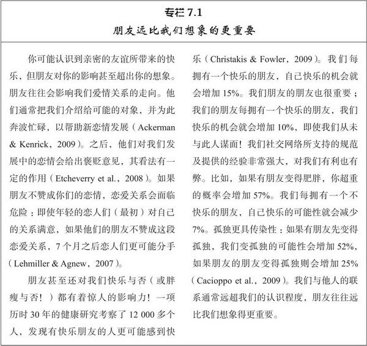
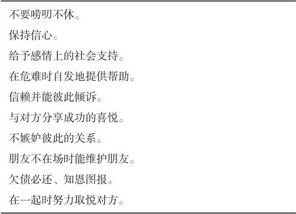
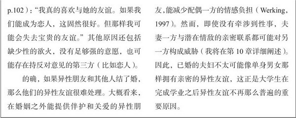
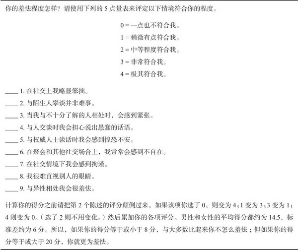

[toc]

# 第7章 友谊

- 朋友关系是否和爱情关系一样，只不过亲密程度更低而已？答案既是肯定的又是否定的，友谊和爱情的构成因素是一样的，但各个因素的结合不同，并且友谊通常也不具备爱情的某些成分

## 友谊的本质

### 友谊的属性

- 喜欢和爱恋都包含对伙伴正面热情的评价，但浪漫的爱情还包括对伴侣的着迷，性的欲望和比友谊强烈的多的排他性的愿望。爱情关系还有更严厉的行为标准；对待爱人应该比对朋友忠诚，更加愿意伸出援手。调节友谊的社会规范较之爱情关系的规范约束力更小，友谊也更容易解体。此外，朋友不太可能公开表达正面情感，在一起相处时间也比伴侣少的多

- 这些差异并不仅是因为友谊发生在同性之间，异性之间的友谊一般也不如爱情那么激情澎湃，忘我投入。所以，友谊一般比爱情承担责任更少，情感强度更弱，排他程度更低。并且和爱情不同，友谊并不存在 性

- 深厚的友谊虽然不如爱情充满激情，但仍然具有奖赏价值，包含着亲密关系的所有其它组成部分。

  - 尊重

  - 信任

  - 资本化

    > 在资本化的交往模式中，我们常常能和朋友分享好消息，得到有益于亲密关系的热烈而有价值的反映，与那些对我们的好运漠然或冷淡的人相比，那些更能提升我们快乐的人让我们感到更亲近

  - 社会支持

    > 我们获得的援助和社会支持有4种。表现为关爱，接纳和安慰等形式的感情支持，拥抱或搂抱的身体安慰，资讯和指导形式的建议支持，表现为金钱或物品的物质支持或有形援助

    

  - 应答性

### 友谊的规则

- 

  

## 友谊的毕生变化

### 童年期

- 儿童在发育和成熟过程中所遭遇到的各种巨大变化无不反应在他们的友谊之中，友谊也逐渐变得更加丰富和复杂。友谊发生重大变化的原因之一就是儿童认知的发展，这些关键的需要表现为：小学低年级阶段的接纳需要，青春前期（9-12岁或小学高年级）的亲密需要，青春期（13-19岁）的性需要。在每一个阶段新的需要都凌驾于旧需要之上，所以年龄大的儿童比年幼的儿童要满足更多的需要。每一阶段需要的顺利解决都要求发展出新的特殊能力。这种能力会影响到儿童在后面阶段的应对方式，如果儿童没有获得这些技能就会出现问题。
- 如果进入小学的儿童不被充分接纳就会感到受排斥和孤立。青春期前期，儿童发展出对亲密的需要，典型表现为关注与自己兴趣相似的朋友。此时充分发展的友谊首次出现，它以广泛的自我表露为特征并且在此阶段儿童表现出观点采择，同理心以及利他主义，这些都是成人亲密关系的基础。先前不被同伴接纳的儿童要克服孤立感，如果做不到，他们将体验到真正的孤独。此后是蓬勃发展的性需要，青少年一般发展出对异性的兴趣。
- 能与照料者形成安全型依恋的婴儿往往在入学时招人喜爱，因此，在童年期建立更丰富，更安全的友谊，这让他们在青年期恋爱时更容易建立安全舒心的亲密关系

### 青少年期

- 13-19岁的青春期友谊还发生其他变化，首先，与家人相处时间越来越少，与伙伴相处时间越来越多
- 第二个变化是青少年日益转向朋友来满足自己的依恋需要，依恋学者提出四种依恋方式：寻求亲近，抗议隔离（抵制与自己伙伴分开），避风港湾，安全基地（依托伙伴来探索新环境和进行大胆尝试）

### 成年早期

- 少年晚期和20多岁时，中心任务是“亲密对孤独”的冲突，埃里克森认为正是在此时，我们学会了怎样建立持久，忠诚的亲密关系
- 大学毕业后的友谊：总的来看，离开学校后每周看望朋友的时间变少，与同性朋友以及三人及三人以上的团队相处时间减少，与异性伙伴相处时间变长，但是异性伙伴的数量减少，这一点上男性表现明显。尽管如此，发展理论认为，参与者20岁时，他们社会交往的平均亲密程度是增加的。大学毕业后，人们往往只与少数几个朋友交往，但交往层次更深，相互依赖程度更强。

### 中年期

- 当人们与爱侣安居后：友谊和爱情之间的关联非常清晰，他们与家人和朋友相处时间减少。
- 人们的友谊消退在结婚之后仍不会停止，与异性朋友的友谊尤其会受到影响，异性朋友可能会被配偶另一方认为是潜在的情敌，所以已婚人士很少探望异性朋友，尽管如此，他们仍有更大的社交网络，因为他们会看望姻亲。
- 当人们投身配偶和孩子时，他们的社会生活并不会完全萎缩破灭，但他们的社交活动从私人朋友转移到夫妻共同朋友。事实上，如果夫妻双方没有共同朋友，这样的婚姻通常很艰难。

### 老年期

- 老年人社交圈子更小，朋友更少。老年人并非不会交际，他们只是更加挑剔，他们的亲密朋友数量和年轻时一样多，但是和一般朋友以及不太重要的社交伙伴相处时间更少。
- 社会情绪选择理论认为，随着有生之年变得越来越屈指可数，老年人的社交目标指向友谊质量而不是数量，他们精选出深厚友谊，不愿发生冲突，让普通朋友关系自然消失

## 友谊的差异

### 同性友谊中的性别差异

- 女性的友谊是面对面，男性的友谊是肩并肩
- 
- 
- 女性朋友之间电话交谈时间更多
- 女性可能更多探讨人际关系和私人问题，男性更可能探讨客观事件
- 女性自我表露多于男性
- 女性给予朋友更多感情支持
- 女性在友谊中表达出更多爱意和温情。
- 最终结果是，女性在爱情关系之外仍然会向朋友寻求敏感，体贴的理解和支持，但是男性常常做不到
- 为了个典型的性别角色保持一致，我们会对男性施加压力，促使他们表现出比女性更多的情感约束，社会规范致使男性比女性更不愿意向他人表达出他们的焦虑和情感，如果社会鼓励表达性的男性友谊（如中东），亲密友谊中的性别差异就会消失

### 友谊的个体差异

- 除了性别效应之外，还存在其他影响友谊的个体差异，其一就是我们在第4章谈到的自我监控

## 友谊发展的障碍

### 羞怯

- 
- 与坦荡的人相比，他们有三个特征。首先，惯常羞怯者害怕负面评价。其次倾向于自我怀疑。最后，他们会感到自己能力不足。
- 羞怯行为并不能给人留下好印象，羞怯所表现出的懦弱，寡言和犹豫行为特征看来好像冷漠无情不太友好。羞怯可能引起对方的冷淡和排斥反映。久而久之，羞怯者更可能受到他人忽略和拒绝，得不到谅解和同理心，这也会强化他们的羞怯
- 大多数羞怯者不需要接受社交技能正式培训，只要精神放松，不再担心别人评判，就可以表现的坦荡豁达。
- 如果羞怯取决于羞怯者是否受到别人的注视，那么人们根本不需要基本社交技能培训，他们所需要的就是镇静和自信
- 如果你是羞怯的人，下次你结交朋友时不要总想自己，只要尽你所能努力寻找对方特点即可。事情或许会出乎意料的好

### 孤独

- 当我们想拥有与他人更多，更亲密的接触而不得时，就会产生孤独感
- 人们会受到两种孤独的困扰，其一是社会隔离，指的是我们不满于缺少朋友和熟人的社交网络而引起的孤独，其二是情感隔离，指的是我们缺乏深厚的人际关系而引起的孤独。
- 孤独通常是一种短暂的状态，任何人与自己的社交圈子隔离一段时间都会感到苦恼，但他持续不了多久，重新回到自己的社交圈子或者建立了新的友谊，孤独就会结束。令人不安的是，与孤独有关的一些个人特征具有耐久性，只能逐渐加以改变。
- 孤独具有遗传性，人们的人格特征能预测他们后来的孤独程度。
- 孤独会随着其他更具变化性的个人特征而变化，不安全型依恋就是例子之一。自尊是另一个影响孤独的可变化的特征。
- 平均而言男性比女性更孤独，但更多取决于他们当前是否能与女性伙伴保持亲近。因为女性常常与其他女性有着亲密的友谊，即使她们没有任何约会情人，在生活中通常也能与其他女性分享亲密的情感。男性则相反，他们与其他男性只能保持相对肤浅的人际关系，一般只有与女性交往时，他们才能真正敞开心扉，因此男性似乎依赖于女性以避免孤独，而女性并不会依赖男性。
- 但更准确的说法是，大丈夫式的男性才真正需要女性来防止孤独。许多男性（约三分之一）和大多数女性一样表达性高，并不需要依赖女性以防止孤独。
- 最后如果人们感到孤独，他们的生活就会没趣味，他们在对待他人的消极态度上表现出的苦恼和绝望显而易见
- 羞怯者只不过显得疏离冷漠，但孤独行为却有破坏作用，令人厌恶。羞怯者只是要与人保持距离，但孤独者却会烦扰和激怒我们
- 雪上加霜的是，孤独还会引起抑郁。抑郁是比孤独更宽泛，更不满和苦恼的状态——孤独产生于人际障碍，而抑郁来源于各种各样的失落和挫折——但他们能相互激化，抑郁使人更难有效率的行动以吸引他人。
- 除了悲观和忧郁以外，抑郁者还会表现出可憎的行为模式，即过度寻求保证。，他们持续不断的探查以确保他人喜欢并接纳他们，但当他们得到保证后又质疑这种保证的真实性。在不满和焦虑中，他们仍继续寻求更令人信服的安慰，也逐渐把他们伙伴的耐心消磨殆尽。
- 如果大学新生能把他们苦恼归因于不稳定短暂的因素，而不是他们自己或者其他人持久的缺陷，他们就能更轻松的克服孤独。把自己的孤独判断为暂时的困难就能乐观的期待事情好转，而充满希望比消极悲观更有可能医治好孤独。