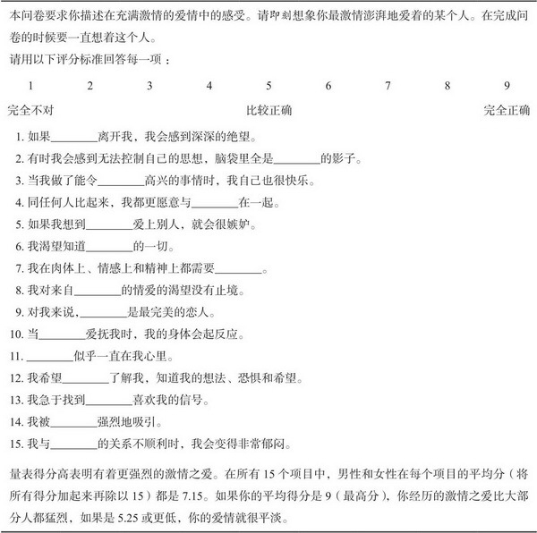
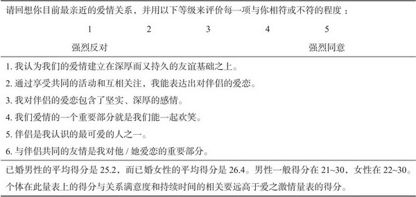
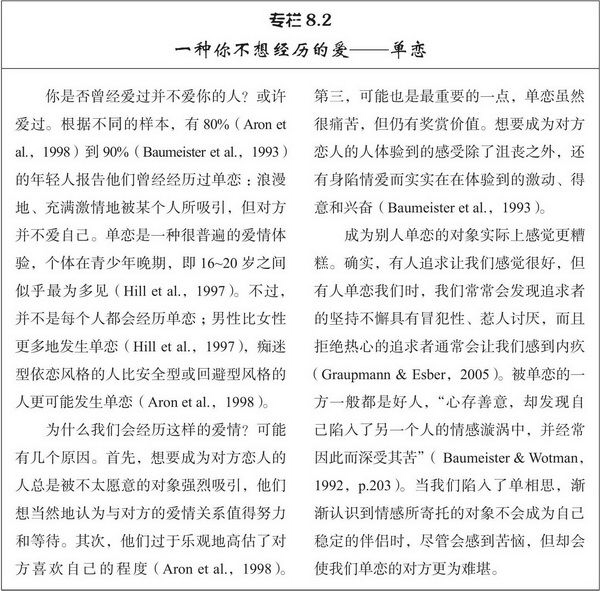
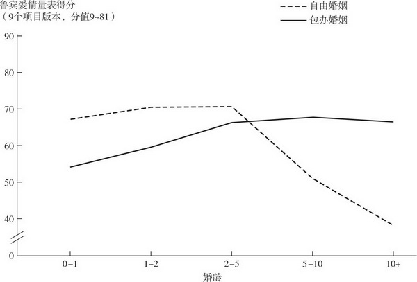

[toc]

# 第8章 爱情

## 爱情简史

- 总结一下所有历史上的关于爱情的不同观点
  - 爱情是一种疯狂
  - 爱情和婚姻几乎没有关系
  - 最完美的爱情发生于同性之间
  - 爱情并不需要有性接触
  - 爱情是高贵的精神追求
  - 爱情注定要破灭
  - 爱情可以是幸福美满的
  - 爱情和婚姻相伴相随

## 爱情类型

- 兰德斯断言，沉迷于色欲和真正的爱情之间有着很大的差别，爱情比纯粹的激情更为深刻和丰富。爱情是构筑在宽容、关爱和沟通基础之上，爱情是“熊熊燃烧着的友谊”。

### 爱情三角理论

- 各种不同的爱情都能由三个构成成分组合而成。第一个是亲密，包括热情，理解，沟通，支持和分享等爱情关系中常见特征。第二个成分是激情，其主要特恒为性的唤起和欲望。激情常以性渴望的形式出现，但任何能使伴侣感到满足的强烈情感需要都可以归入此类。最后一个成分是承诺，指投身于爱情和努力维护爱情的决心。承诺在本质上主要是认知性的，而亲密时情感性的，激情则是一种动机或者驱动力。恋爱关系的火热来自激情，温情来自亲密，承诺反映的是完全与情感或性情无关的决策
- 这三个成分就是爱情三角形的三条边，可以描绘两个人之间的爱情。每个成分的强度都可以从低到高变化，所以爱情的三角形可以呈现各种大小形状。
- 我们只考虑几种相对纯粹的爱情类型，即某一成分非常低，而其他成分充足的爱情三角形。
  - 无爱。如果亲密，激情和承诺三者都缺失，爱情就不存在。两个人可能仅仅是泛泛之交而不是朋友，彼此的关系是随意，肤浅和不受约束的。
  - 喜欢。当亲密程度高而激情和承诺都非常低时就是喜欢。喜欢多表现在友谊之中，伙伴双方有着真正的亲近和温情，却不会唤起激情或与对方共度余生的期望。如果某个朋友的确能唤起你的激情，或者当他离开时你会强烈的思慕，那么你们之间的关系就已经超越了喜欢，变成其他类型了
  - 迷恋。缺乏亲密或承诺却有着强烈的激情即使迷恋。当人们被几乎不认识的人激起欲望就会有这种体验
  - 空爱。没有亲密或激情的承诺就是空虚的爱。在西方文化中，这种爱常见于激情燃尽的爱情关系，既没有温情也没有激情，仅仅是一起过日子。不过在有包办婚姻的社会中，空爱或许是配偶们生活在一起的第一个阶段，而不是最后一个阶段
- 爱情是复杂的体验，如果我们把爱情的三个组成部分结合起来形成更复杂的爱情形态，这一观点就更清楚：
  - 浪漫之爱。有着强烈的亲密感和激情，可以把它视为喜欢和迷恋的结合。人们常常会表现出对浪漫爱情的承诺，但斯腾博认为承诺并非浪漫之爱的典型特征
  - 相伴之爱。亲密和承诺结合在一起就是相伴之爱。双方会努力维持深刻，长期的友谊，这种爱情表现出亲近，沟通，分享以及对爱情关系的巨大投入，相伴之爱的典型例子是长久而幸福的婚姻，虽然年轻时的激情已逐渐消失
  - 愚昧之爱。缺失亲密的激情和承诺会产生愚蠢的爱情体验。这种爱情会发生在旋风般的求爱中，在压倒一切的激情基础上双方闪电般结婚，但是彼此并不了解或喜欢对方，在某种意义上——这样的爱人在迷恋对方时投入太多，很可能得不偿失
  - 完美之爱。最后，爱情的三个部分——亲密 激情 承诺都非常充足时，人们就能感受到彻底的或完美的爱情。这是许多人都追求的爱情类型，但是斯滕伯格认为完美之爱就像减肥，短时间容易做到，但很难长久坚持
- 爱情的三个组成成分会随着时间发生变化，所以某对特定的爱情伴侣在不同时期可能会体验到各种不同类型的爱情。不过在三个成分中，激情最容易变化，也最不容易控制。所以我们发现我们对伴侣的欲望急剧飙升，随后又迅速消退，我们很难控制
- 对爱情生理基础的研究表明激情和亲密时完全不同的体验。调控性欲望的脑区看起来与支配依赖情感的脑区截然不同
- 事实上，我们并不爱恋的人也完全有可能勾起我们的性欲望，而从使我们快乐的依恋的人身上却可能感觉不到多少激情
- 性欲由荷尔蒙调控。性欲使得人们有性交的动机，从而使人们成功繁殖
- 吸引力促进人们追求他们的恋人。它由特定脑区里控制奖赏情感的神经递质多巴胺和5-羟色胺来调控。当我们坠入爱河时，多巴胺水平上升，引起兴奋和欣喜，而5-羟色胺下降给予我们更多能量去不知疲倦的追求心上人。这种混合也许就是“爱人们感到欣快，精神抖擞，乐观豁达和精力充沛，并能快乐的秉烛夜谈，通宵达旦，或者连续数小时不停做爱的原因”
- 最后是依恋，这里的依恋是指长期的伴侣关系所带来的舒适安全感。这种情感让夫妻厮守在一起的时间足够长，从而能保护和供养他们年轻的子女。依恋驱动的是相伴之爱，由神经肽催产素调节
- 我们天生就具有演化而来的三个不同的生理系统，它们各自促进了人们成功的繁殖过程——它们也支持了这样一种可能的结果：激情 亲密 承诺彼此相互独立，在任何时间都可以独立发生变化。同时，在很多爱情关系中，亲密 激情 承诺的情感体验又相互有着明显关联。比如男性看色情书时有着性唤醒比平时更加爱恋伴侣

### 浪漫狂热之爱

- 正如爱情三角理论指出的，性的吸引力是浪漫的爱情必不可少的特征之一，所以如果你的恋人对你说“我只是想和你做朋友”，会令你很受打击
- 浪漫爱情包括激情，这一点很重要，值得一提的是，任何形式的唤醒，无论好坏都影响我们对浪漫爱情的感受
- 一项对浪漫爱情的经典分析认为，激情洋溢的吸引力根源于两个因素：生理唤醒，如心跳加快。相信另一个人是引起这些反应的原因。根据这一个观点，当情感唤醒是由于出现另一个有吸引力的人时，浪漫的爱情就会产生或者至少得到增强
- 爱的激情量表
- 
- 研究表明，肾上腺素增强了人们的爱情体验，不同类型的高唤醒，包括简单的体力活动和恐惧，厌恶，快乐等情绪状态，似乎都可以提高我们对合意伴侣所感受到的浪漫吸引力
- 你是否曾经与爱人大声争吵，而几分钟之后亲吻和解会显得格外亲密？或许你的愤怒增加了随后的激情。
- 浪漫爱情的一个方面就是高度唤醒的兴奋和欢快，各种能使我们兴奋的事件都可以增加我们对伴侣的爱恋。然而浪漫不仅仅是激情，还涉及我们的思维。
- 人们对伴侣做出的特殊判断很重要。正如我们在第4章看到的，人们对伴侣有乐观美好的看法，爱的最深时对爱人的理想化和赞美也达到了顶峰。事实上，一旦产生了浪漫的爱情，人们开始忽略有关未来伴侣的不好信息，或者重新解释这些信息
- 研究结果都表明：现实中“爱情是盲目的”：人们会低估或忽视伴侣的缺点。他们将伴侣理想化，这与他们面对的具体事实有着重大差别。事实上，爱情和友谊的重要差别在于我们的想象——伴侣时迷人神秘而又吸引力的，朋友则不是这样
- 浪漫的爱情还能让我们轻易把那些对当前伴侣具有挑战性，对我们有一定诱惑力的替代伴侣抛之脑后
- 最后当我们坠入爱河时，甚至我们对自己的看法都会改变。他们的自我概念变得多样化，自尊得到提升，这就是坠入爱河让人如此快乐的两个原因

### 相伴之爱

- 相伴之爱并不依赖于激情，所以它比浪漫之爱更为稳定。三角理论认为相伴之爱是亲密和承诺的结合。但我们可以更充分的把它描绘为对可爱伴侣的舒心的 温情的 信任的爱恋，它以深厚的友谊为基础，包含相伴相随，共同爱好活动，互相关注和一起欢笑。它的表现形式是丰富，忠诚的友谊，而对方就是与我们的生活相互交织的人
- 当问及数以百计的结婚至少15年以上的夫妻，为什么他们的婚姻能持续时，男女双方提到最多的两个理由是，配偶是我的好朋友，我很喜欢配偶这个人。持续满意的婚姻似乎包括了很多成分的相伴之爱
- 基于友谊的爱情量表
- 
- 当然，在浪漫爱情的背景下也能产生深厚的友谊，不过，当友谊也成为浪漫爱情的一部分时，友谊就会和性唤醒即激情相结合（有时混淆在一起）。在相伴之爱中更容易觉察友谊的重要性，此时亲密伴随承诺一起出现，而在浪漫爱情中较不容易觉察友谊，此时亲密和激情同时出现
- 相伴之爱还与浪漫之爱具有不同的生理基础，促进人放松并减少压力的神经肽催产素好像与相伴之爱有关。处在分娩和哺乳期的妈妈会分泌，年轻妈妈血液中含量越多，就越会搂抱婴儿，与婴儿喃喃细语，照看婴儿并微笑。对于成人，爱人接吻会刺激催产素释放，尤其是性高潮时会释放大量催产素，催产素可能是夫妻在做爱之后会感到放松和嗜睡的原因之一。血液中含量越高的人在与配偶讨论棘手问题时往往会显得更温和，善良。
- 
- 相伴的爱人可以也的确能体验到激情，同样浪漫的爱人也可以体验到承诺。当我们真正经历爱情时，浪漫之爱和相伴之爱这两种爱情的区分比我们这里讨论的模糊的多。只要我们愿意容许一些模棱两可，就可以得出结论，美国人的爱情关系中存在两种最常见的类型：一种爱情充满激情，另一种爱情充满友谊。久而久之，在持续的爱情关系中相伴之爱一般要强于浪漫充满激情的爱情，它与人们对爱情的满足有更高的相关

### 同情之爱

- 在成功的浪漫关系中还有第三种爱情。爱情三角理论并无介绍，因为该理论并不认为对伴侣周到体贴的关心也是爱情的特定成分。但关爱却有可能是爱情中的成分。对伴侣幸福进行利他主义的关心和关注是同情之爱的定义性特征，这种爱结合了亲密关系中的信任及理解与同情及关爱，关爱中包含同理心，无私和为爱人牺牲的意愿。
- 具有同情之爱的人往往会与爱人同甘共苦，宁愿自己受苦，也不让自己亲近的人收到伤害，他们大方且有同理心
- 同情之爱与浪漫之爱，相伴之爱的体验有着很高的相关。但仍存在值得注意的差别。浪漫之爱是盲目的，但同情之爱却根源于对伴侣优缺点更准确的理解上，我们认识到他们的不足，但我们不管怎样还是爱他们。同情之爱无私关照的核心特征可能是无价的，能保护和维系亲密关系，即使伴侣因为年龄垂垂老矣，或者因为厄运让伴侣意外从好变差

### 爱恋风格

- 另一套区分不同类型的爱情体验的体系是社会学家提出的描述六种爱情风格。差别在表现在爱恋情感的强烈程度，对爱人的承诺程度，期待的爱人特征以及得到对方回报的爱情期望。
  - 第一种，情欲之爱，有着强烈的肉欲色彩，可能会受到外表的影响，相信一见钟情
  - 第二种，游戏之爱，反复无常，（试图）同时拥有几个伴侣
  - 第三中，友谊之爱，引导人们不再重视强烈情感，而去寻找真正的友谊，逐渐发展为真实的承诺
  - 第四种，狂热之爱，难以满足，占有欲强，充斥着生动的幻想和沉迷
  - 第五种，利他之爱，无偿付出，无私，把爱情当一种职责
  - 第六种，现实之爱，客观务实，令人冷静的寻找理论上和自己最般配的伴侣
- 其中一些爱情类型与其他研究较多的爱情类型有关，但也有些没关系

## 爱情的个体和文化差异

### 文化

- 美国人在描述坠入爱河的体验时，比中国人更强调恋人的俊美容貌和共同点，而中国人比美国人更多提及温和性格，别人看法和自己的生理唤醒。之后当他们步入婚姻时，中国和美国的已婚夫妇都会感受到许多温情的关爱和对伴侣的性欲，但也存在文化差异。而在美国，浪漫幻想更突出，而在中国则更普遍承认伴侣也会令自己困惑，难以理解，爱情本身也有坏。
- 西方国家崇尚个人主义的人比东方国家强调相互依赖的人更坚持认为，爱情是婚姻的原因。具体而言，中国大学生比美国大学生在应该与谁结婚的问题上更可能遵从父母意见。而中国的婚姻通常是家庭做决定，美国的年轻人则往往希望完全由自己做主选择配偶。

### 依恋类型

- 文化对爱情的影响并不如个体差异那般明显，具体而言，不管何种文化，依恋的两个维度，忧虑被弃和回避亲密都非常重要， 因为它们与爱情的所有成分都有关系：亲密 激情 承诺 关爱
  - 亲密，安全依恋类型的人一般很重视其他人，认为别人值得信任，可以依赖和心地善良，他们往往很坦诚，心情愉快的进行大量自我表露。而不安全的人则持有戒心。
  - 激情。痴迷型的人的生活存在很多戏剧性场景，但大部分并不愉快。忧虑被弃常常使他们感到不安，提心吊胆而不是幸福快乐。回避亲密的人疏远冷漠，他们的激情更加不带个人色彩。所以只有安全型依恋的人才能体验到最美妙，满足的性生活，他们性生活次数更多，有着更多的唤醒，更大的愉悦，更多的次数的高潮以及更大的满足
  - 承诺。安全型的人比不安全型的人更加忠诚于伴侣关系。因为他们有更亲密积极满意的交往
  - 关爱和看护。需要支持时，不安全型的人并不是有效的看护者，他们提供的安慰更少，也不能让伴侣放心。高回避的人会表现消极恼怒。焦虑型的人经常会提供很多帮助但他们往往是为了一己私利才这样做的，希望获得伴侣的赞许。

### 年龄

- 多数人会变得成熟。年龄大的夫妻会有更多精神的快乐，较少的肉体唤醒。他们情绪不是很强烈但是整体更积极，即使在婚姻不太幸福的时候。步入婚姻殿堂的灼热急迫和强烈的情感随着时间变弱，取而代之的是对爱情更温和成熟的看法

### 性别

- 整体来看，男性和女性在爱情方面共同点多于不同点
- 男性往往比女性有着更浪漫的态度体验，他们比女性更可能认为只要爱一个人就已足够，其他的都不重要。他们更可能相信一见钟情式的爱情体验。他们往往比女性更快坠入爱河。女性在爱情方面比男性更为谨慎，对对象更挑剔，更迟缓的感受到激情，她们将爱慕之情限制在适配价值更高的伴侣身上。男性往往不会这么严格的区别对待，比如，男性一般来讲比女性更能接受随意的性关系
- 男性似乎还看重激情，男女两性都认同爱情应该温情脉脉 忠贞不渝，但男性比女性还认为爱情应该有着更多的激情。的确， 爱情的三个成分中，激情与男性关系的满意度有着很高的关系，承诺则是预测女性满意度的最好成分

## 爱情能持久吗

- 尽管夫妻有着美好的愿望，人际关系科学所能给出的最好答案是：可能做不到，至少达不到伴侣们所期望的程度
- 
- 随着时间流逝，人们在浪漫和爱之激情量表上的得分都会下降，这还是那些努力维持婚姻的夫妻的情形。结婚几年之后，夫妻们就不会再像从前那样真心诚意的声称，彼此愿意为对方做任何事情，或者互相凝视对方的双眸时，根本不会有陶醉的感觉
- 有时候夫妻浪漫爱情的减少非常迅速，仅仅在结婚2年后，夫妻彼此平均表达出的情爱就比他们刚结婚时少一半。从世界范围看，婚姻之后的第四年是离婚最频繁的时间段。很多夫妻，即使不是大多数，并不能维持彼此之间的迫切渴望，而正是这种相互渴望在一开始促使他们步入婚姻

### 浪漫的爱情为何难以持久

- 浪漫爱情之所以会随着时间减弱的几个原因：
  - 幻想促进浪漫。如前所述，爱情在一定程度上是盲目的，洋溢着激情的爱人往往会将他们的伴侣理想化，缩小或忽略那些使他们止步不前的不利信息。想象 希望和异想天开的幻想使与我们差异很大的人看起来很有吸引力，至少在一段时间内是这样的。当然问题在于随着时间流逝和经验积累，幻想会逐渐减弱。伴侣之间理想化的赞美能促进浪漫，仅就这一点足以预期：当伴侣双方生活在一起，变得越来越现实时，浪漫会逐渐消退
  - 仅仅是新奇也能为新确立的爱情关系注入兴奋和能量。恋人之间的初吻比之后成千上万的亲吻更令人激动，而当人们为新的伴侣而精神抖擞，魂牵梦绕时，绝不会意识到在30年后自己的爱人会变得多么熟悉和习以为常。
  - 研究者把这种新奇对性唤醒的影响称为柯立志效应。新奇对人或许也有相似作用，浪漫的夫妻一起参加新奇兴奋的活动会让他们彼此更加相爱。并且有学者认为浪漫的激情和爱情关系的变化有着直接的关联。当我们坠入爱河时，我们的自我在扩展，事物是新鲜的，亲密感不断增加，激情就可能很高亢。然而，一旦确立婚姻关系，新奇感消失，激情逐渐减退，婚姻关系越持久，激情变得越少
- 可以认为，“浪漫因新奇 神秘和危险而繁盛，因了解熟识而消亡。持久的浪漫只不过是自相矛盾的说辞”
- 唤醒随着时间的流逝会逐渐消失。就浪漫爱情而言，当伴侣变得熟悉时大脑可能根本无法产生足够多的多巴胺，所以即使你的伴侣能一如既往的完美，你也不能像过去那样被唤醒。无论如何，不管何种原因，爱情的激情成分比亲密和承诺会更快发生变化。这就意味着浪漫的爱情也会发生改变

### 爱情的未来怎样

- 因为浪漫激情的三个重要影响因素——幻想 新奇和唤醒——一般都会随着岁月流逝而减弱，所以浪漫爱情也会日渐消退
- 这可能是美国人离婚率如此高的原因之一：普遍抱怨爱情“魔力”消失了
- 不过我们并不希望这一消息让你沮丧，相反，我们认为它为人们拥有成功的长期爱情提供重要启示。通常促使人们结婚的爱情和使人们数十年厮守的爱情并不一样。随着我们变老，激情会消退，但亲密和承诺都会增强。因此，相伴之爱比浪漫之爱更稳定。如前所述，能长期维持幸福婚姻的人通常会想配偶表达出许多相伴之爱。这样的人也常常活的很快乐：虽然相伴之爱不依赖于激情，身处相伴之爱的人仍会感到很满足。并且因为亲密和激情存在相关，夫妻成为好朋友也有助于维持激情。
- 所以，你只要投身于同时是好友的爱人。你还可以有目的 创造性的防止可能损害满足感的任何厌倦情绪。当爱情关系变得重复单调沉闷时就会止步不前，并非已出现坏事就会厌倦，而是婚姻生活变得没有情趣，难以让人兴奋或者没有挑战性时才会滋生厌倦。厌倦是爱恋和满意和对立面，所以厌倦的出现时非常糟糕的信号。如果不再有新奇，就去创造新奇，不要停止寻找新颖，吸引人的共同娱乐的好办法
- 这就是你爱情的策略，享受激情，但不要把它作为维持爱情关系的基础，培养与爱人之间的友谊，努力保持新鲜感，把握住每一个与配偶共同进行新奇探索的机会。如果对爱人急迫的欲望渐渐变为平静而深厚的情感，不要觉得奇怪或失望。这种幸福的结果可能会让你成为幸福的爱人。