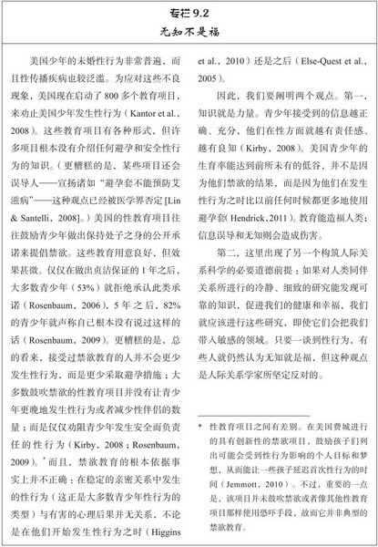
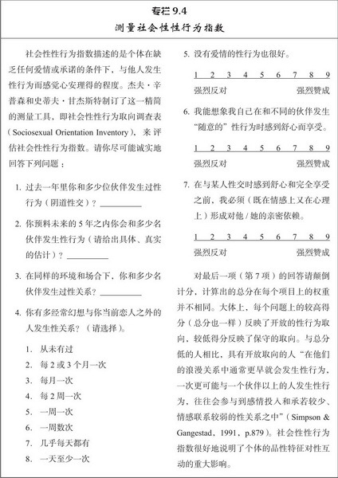
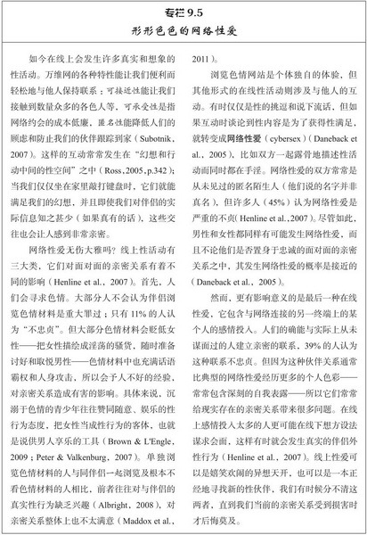
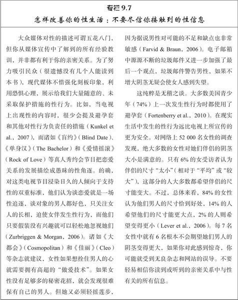
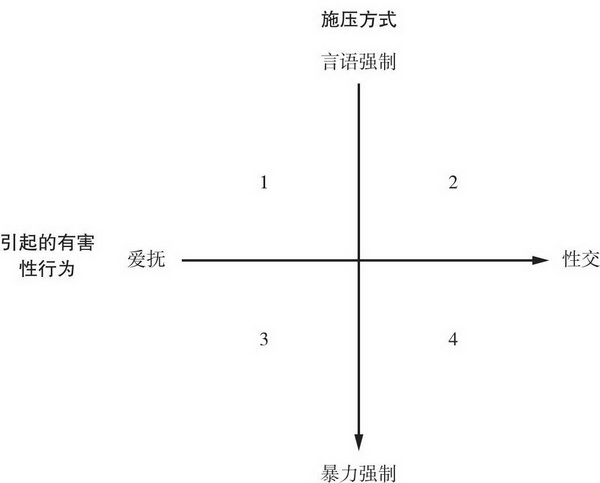

[toc]

# 第9章 性爱

## 性态度

### 对随意性行为的态度

- 如今只有不到25%的人认为婚前性行为总是或几乎总是错误的。现在大多数人还能容许发生在婚姻之外的性行为，但这要看具体的环境因素。大部分人一般仍然不赞成彼此没有承诺的人发生性关系。因此我们会持有以情感为标准的性认可态度：只要未婚的恋人是在有承诺的爱情基础上发生性行为就可以得到容许。我们不能再指望人们像老太太认为的那样为婚姻守身如玉，但亲密关系中的依恋和情感仍然被认为是性行为最合理的前提
- 男性在性的价值取向和态度上更为宽容，虽然男女随着时代的进步这种差异会越来越小，但差别大小取决于所要测量的具体态度。男女两性在性观念上的最大的差异是对待婚前随意性行为的态度：男性比女性更可能认为没有爱情的性也可以接受，这种差异毫无疑问会影响男女两性对过去性行为的反思：女性更可能后悔自己过去的行为，而男性更可能悔不当初（如有人追求自己时没有发生性关系）。谈到随意性行为时，女性往往后悔自己的行为，男性则后悔自己没有行动

### 对同性恋的态度

### 性态度上的文化差异

- 

## 性行为

### 第一次性行为

- 几乎所有的人（95%）都在结婚前有过性行为。普通的美国人直到25-30才结婚，但是男女第一次性交的平均年龄是17岁。到20岁时只有少数人（15%）还未曾有过性行为
- 绝大数青少年第一次发生性行为的伴侣都与他们有着稳定感情上所重视的亲密关系，他们发生关系的过程都遵循行为越来越亲密的轨迹：接吻导致爱抚，最终发生性行为。他们第一次的性伙伴较少为仅仅相识的人或者是一般朋友。年轻的女性在发生第一次性行为时一般会有复杂的情感体验。她们中大多数对性行为有着矛盾的情感，有些女性甚至反对发生性关系。只有三分之一的女孩真正渴望性行为。年轻的男性通常有不同的看法：只有三分之一的男孩具有矛盾的情感，大多数人渴望发生性行为
- 一旦伴侣之间发生性关系，其发生的背景会影响性行为的结果。如果第一次性行为遵循了伴侣明确表达出的爱意和承诺，则伴侣们常常会把它体验成关系的积极发展，能增加彼此的亲密情感。然而，如果第一次性行为没有这样的表达，性行为的结果通常使关系发生令人讨厌的变化，导致不确定性和悔恨。伴侣之间的相对权利对比似乎也会产生影响，因为如果与比自己大上几岁的人发生第一次性行为，男女双方往往会体验到更多的悔恨；与年龄差不多的伴侣的第一次性行为相比，这类伴侣的性行为发生的更早，更不可能使用避孕套。除此之外，男女两性对性经历后悔的心态差别并不大——当性行为方式与他们的道德不一致，醉酒性交或者没有使用避孕套时，男女两性都会感到深深的懊悔。

### 忠诚关系中的性行为

- 发生性行为的各种理由如此纷繁庞杂，可以将其大体分为四个方面。其一涉及性的情感成分，以性行为作为沟通 传递爱意和忠诚的手段。其二涉及性的肉欲方面，包括从性行为中获得感官享受和未来伴侣的长相吸引力。其三是更为实用的理由，包括要实现某些长远目标或完成某些具体的目标的愿望，从生孩子到使伴侣嫉妒，范围广泛。最后是不安全的理由，包括提高个体的自尊或防止伴侣移情别恋。男性和女性都会同等的赞成情感的理由。但男性比女性更可能因为肉欲 实用和不安的理由而与人发生性关系。这些差异常常非常细微，但男性所报告的性行为理由仍然比女性更多样化，更实际。显而易见，虽然性行为时表示爱意的行动，但它有时却并不带有浪漫的目的
- 人们性行为的次数受到其亲密关系性质（和持续时间）的影响。同居的情侣平均每周都会有3次性行为，而已婚的夫妻每周的性行为约为2次。另一个和性行为频率有关的重要因素就是年龄
- 如果你是为年轻人，你的亲密关系能得以维系（至少部分的）是因为非常火热的性生活，如果你期望自己对伴侣的激情 性欲和需要将来都不会变化，那将是十分愚蠢的，性行为当然会随着年龄变化

### 不贞

- 研究者对47项不同的调查进行了总结，一共涉及逾58000名参与者， 大部分居住在美国并且已婚，结果发现21%的女性和32%的男性在性方面至少有一次出轨，不忠于他们的爱情伴侣。大部分丈夫和妻子在结婚后从未与其他人发生过性行为，但约有五分之一的妻子和三分之一的丈夫有婚外性行为
- 当然，并且所有的男性都喜欢乱交，也并非所有女性都是贞洁圣女，还有比性别差异更重要的个体差异，它使得男女两性更可能发生伴侣外性行为。对某些人而言，性行为与爱情和承诺联系在一起，与自己不很了解或不太关心的人发生性行为并没有特别的奖赏价值，他们极少与泛泛之交或陌生人发生随意的性行为。然而，对另一些人而言，性行为与爱情和承诺没有多少联系：他们认为没有爱情的性行为也很好，与没有感情的人发生性行为也令他们感到满足，这种性态度的差别来自于个体的社会性性行为取向，它是一种类似于信念和行为等特质的集合，可以用来描述个体对性行为的看法。
- 只有在承诺和充满深情的亲密关系背景下才愿意发生性行为的人就具有保守的社会性性行为取向，而那些追求性行为时并不寻求足够的亲密和承诺的人就具有开放的性行为取向。具有开放的性行为取向的人往往精力充沛 喜欢调情卖俏，总是在寻找新的性伙伴。他们喜欢交际，外向开朗，千杯不醉。在全世界，平均来看男性比女性更为开放。具有开放的性取向的人一生之中性伴侣数量更多，更可能欺骗他们的爱人
- 
- 观察者一般都能分辨性行为取向开放者（他们看上去就在猎色）和性行为取向保守者。性开放的女人的面部特征比保守的女人总是显得有些男性化。更明显的是，虽然她们更吸引人，但男人认为她们并不适合做长期伴侣。她们显得可爱，但与其他女人相比似乎不值得信赖。性开放的男人看上去也很有阳刚之气，但女人更喜欢性保守男人的面孔，认为他们更适合做长期伴侣，她们似乎意识到开放的男人将来都会成为危险的丈夫
- 如果女性仅仅是为了性的多样化目的而追求伴侣外性行为，那么在每个月仅有数天的受孕期里取悦与其他性伙伴就显得非常愚蠢，但她们就是这样做的；女性在受孕期比其他时候更容易受到伴侣外性伙伴的吸引，这种倾向在她们的爱人相对丑陋的情况下更为突出
- 在遥远的过去男性偶尔会碰到精子竞争的情形，当两个或更多男性的精子同时充溢这一位女性的阴道时就会产生竞争。有研究者声称为了应对这种情况，长期演化使男性的阴茎有最完美的性质，从而能把其他男人的任何精子从他们伴侣的子宫颈排挤出去。根据常识人们会认为，第二位性交的男性会把前一位男性的精液从子宫颈推到子宫里，但并非如此。阴茎的纵深的抽插会把任何已经出现在阴道里的精子挤压到龟头后方，随着把精子带出女性体内。的确，如果女性把男性置于精子竞争的风险之中，他们往往会表现出特定的性交方式——在较长时间阶段里出现更多次非常深的插入——这特别有可能替换掉先前其他人留下的精子
- 
- 不幸福的爱人如果有着诱人的替代伴侣就不太可能保持忠贞，如果在这样的情境下他们的确出轨，女性比男性更可能与原来的伴侣分手，而与新配偶建立新的长期的亲密关系。因此，女性更可能因为婚外情而更换配偶，然而，即使婚姻生活大体还算满意，如果伴侣间的性行为乏味 单调 次数太少，男女双方都更可能追求伴侣外性行为。如果女性渴望更多的性行为而伴侣做不到，她们就特别有可能会红杏出墙

### 性欲望

- 平均而言，男性比女性有着更高的性驱动力。他们比女性体验到更频繁，更强烈的性欲望，通常他们的性活动有着更强烈的动机激励。对年轻人的研究发现，男性每周会体验到37次性欲望的经历，而女性体验到的只有9次。
- 请记住男女之间存在相当大的个体差异，并且肯定有很多男性长期来看并不如某些女性那样好色。尽管如此，大量事实表明在全世界男性整体比女性有更高的性驱动力
  - 男性更经常手淫。有着固定性伙伴的男性几乎有一半的人仍然每周手淫一次以上，而置身于性关系中的女性只有16% 的人这样频繁的手淫。 在英格兰，16-44岁的男子中73%的人在上一个月手淫过，而女子只有37%
  - 男性比女性更经常的渴望性生活，在次数一样的情况下，男性比女性更可能感到不满足
  - 在亲密关系发展的过程中，男性希望开始发生性行为的时间一般要早于女性。
  - 男性比女性更经常进行性幻想。男性每周约有60次想到性行为，女性只有15次
  - 男性在性上花费更多金钱，购买更多的性玩具和色情素材
  - 男性平均比女性更能接受随意性行为，愿意与更多人发生性行为
- 把这些现象加在一起，性驱动力方面的性别差异或许就不是一个小问题了，当异性恋的夫妻协商他们的性互动时，上述每一种现象都或多或少的引起误解和苦恼。
- 在性驱动力上典型的性别差异意味着有些伴侣在性欲望方面会面临不协调，这种不协调会随着时间推移变得更严重，大多数女性在绝经期之后性欲望都会下降
- 男性比女性期待更多的性行为，可能还会引起更严重的后果。女性作为决定性行为发生与否的看门人，会发现男性为了换取性行为愿意做出各种让步。男性对性行为的更多兴趣可能使较小利益原则发生作用：女性控制了男性想要的事物的使用权利，这让她们拥有了影响男性的力量。在某些关系中，性行为可能是“亲密关系市场中女性作为卖方，而男性作为买方的一件待价而沽的珍品”
- 这点看上去粗鄙不堪，但情侣们无需介意于这一现象，以免影响他们的交往。相反，人们总是想当然地认为，女性如果长期接受男性许多的礼遇——比如昂贵的约会和其他令人满意的招待——就应该有义务使他们关系更加亲密（否则她就应该停止接受这些礼遇）。咨询专栏作家认可了这一点：“女性并不认为免费的宴请就应以性来报答，但承担所有约会开销的男性却认为女性对浪漫的、最终亲密的关系感兴趣。否则他们就会觉得被人利用并痛恨此事”。这一模式的消极后果是，当男性感到女性“亏欠”他们时，就会理直气壮地施加压力或强制女性发生性行为。

### 安全而明智的性行为

- 每天都会发生很多随意的性行为，但只有部分性行为是安全的。大多数大学生——约四分之三——都曾有过随意的性关系，即和没有恋爱的伴侣发生性关系，而且常常只持续一个晚上，根本不会有任何建立长期关系的愿望。大多数一夜情的双方是非常熟识的——很多时候性伙伴是自己的朋友——但有很多一夜情（37%）的双方并不认识或者不是很了解。一些一夜情只有接吻和性爱抚，但大约有一半的当事人会发生口交或者性行为（尤其如果有人醉酒时），如果发生了性行为，大概只有一半的情形会使用避孕套
- 在恋爱关系中性行为更加不安全——大学生在和新的恋人开始发生性行为时，只有—半的人会始终坚持使用避孕套——而在校园之外，情况更为严重。
- 为什么这么多明智的人却会发生如此多的不安全性行为？有几个原因：
  - 低估了不安全性行为的风险。一种特别的偏差叫特殊安全错觉，也会影响到我们对风险的估计。大多数人都会认为不幸的事件通常更可能发生在别人身上，而自己不会这么倒霉，所以我们不会采取明智的预防措施，以避免可以预见到的危险。具有讽刺意味的是，正是那些认为自己不太可能会感染性病的人更不可能使用避孕套，这使得他们更可能感染性病。人们甚至在已经患上性病之后，仍认为自己不可能感染性病
  - 错误决策。本打算使用避孕套的人有时头脑发热会改变主意，之后又会感到后悔。原因之一是性唤醒。当大学男生变得性兴奋时，他们看待事物的角度和他们清醒时已然不同：花样变化的性行为（比如掌掴屁股）看起来更有诱惑力，存在道德问题的行为看起来更能接受，而避孕套则不怎么令人愉快。男性一旦变得性兴奋，真的会“失去自制力”。过量饮酒也会影响我们的决策，在性唤醒时尤为如此。当人们醉酒后，和别人第一次发生性行为时不太可能会使用避孕套，这部分是因为醉酒使他们忽视了可能发生的危险，而把性事想得太过美妙。这种现象被称为酒精近视，指的是人们在醉酒后思考和加工信息的能力会降低。这种受限的能力意味着他们只能把注意力集中在最直接和最明显的环境线索。人们醉酒后，头脑里只有充满诱惑力的性伴侣，他们完全忘记了之前要使用避孕套的意图，尽管避孕套就装在他们的口袋或者钱包里。酒精和性唤醒显然是导致人们发生高危性行为的罪魁祸首。
  - 人众无知。随意性行为的一个突出特征是，它并不如大多数人（包括寻求一夜情的人）所认为的那般受人欢迎。男女两性从自己的随意性行为中体验到的乐趣并不如他们认为得那般美妙，[大多数的男人和女人都喜欢只为了随意性行为而与人约会，尤其是一夜情发生性交或口交的女性会感到惴惴不安。尽管如此，大多数年轻人仍然认为其他人一般会赞同这类行为，因此他们会感到迫使他们发生随意性行为的社会压力。这种心理现象就是人众无知的表现，如果人们错误地认为他们的情感和信念与其他人不一样，就会产生人众无知。团体中的人群通过错误解读彼此真实的偏好，最终每个人都认为大家所遵循的行为规范获得了广泛的认同，但几乎没有人私下支持这种规范。因而，大学男生或许会明智地希望发生安全的性行为，但却又做不到，因为他们错误地认为安全性行为并不流行。我们对他人态度和行动的判断会影响我们的性行为，但这些判断并不总是正确的。的确，女性认为男性对避孕套持更消极的态度，但男性未必如此。如今，男性和女性在使用避孕套的意愿上并无差别
  - 权利不等。如果伴侣双方拥有的权力不等，而强势一方反对使用避孕套时，他们就不太可能会使用避孕套。一般而言，女方权力越大，越诚实和直率，她和伴侣在发生性行为时就越有可能使用避孕套。
  - 禁欲教育。为了使青少年相信禁欲是唯一正确的做法，一些禁欲教育项目对学员宣称避孕套没有作用。适得其反的是，当这些青少年发生性行为时——大多数青少年都会这样做——他们与其他的青少年相比更不可能使用避孕套
  - 亲密感和愉悦度的减少。在所有影响安全性行为的因素中，最重要的阻碍或许是，人们不使用避孕套通常能更好地享受性生活。男女两性都觉得如果没有避孕套，性事更令人快乐，并且男性尤其可能喜欢没有防护的性行为。未使用避孕套的人们认为他们的性事更为亲密，情感上也更为满足，因此，很多人（30%的男性和41%的女性）的性伙伴试图说服他们不要使用避孕套。

## 性满足

- 
- 在美国只有单一爱人的人比起那些有着两个或更多性伙伴的人，更普遍地体验到高度满足的性生活——一般而言，只要夫妻极为忠诚于他们的伴侣关系，珍视一夫一妻制（彼此保持忠贞），他们就可能对性生活满足。拥有一个以上的爱人或许令人感到刺激，但大多数人发现忠诚于某个特定的配偶似乎更充实。
- 人们发生性行为的频率也有着重要的影响，至少对于男人而言是如此。在一项经典的研究中，每周有3次或者更多次数性行为的夫妻中有89%的人报告对他们的性生活感到满足，而一个月仅有一次性行为的夫妻中只有32%的人感到性满足
- z这类相关现象的影响因素很多，但有两种模式值得注意。首先，性生活的频率对于男性比女性更重要，其次，更频繁的性行为的确能增加新婚男士在性生活中体验到的满足感；随着时间的流逝，如果性行为变得更为频繁他们会感到欣喜，而如果性行为减少则会感到苦恼。
- 但无论性行为的频率怎样，只要它能实现人类对自主、能力和交往的基本需要，性的互动就最有奖赏价值。根据自我决定理论的基本观点，如果我们日常参与的活动能让我们选择和控制自己的行动（即自主），感到有信心和能力来应对（即能力），并且能建立与他人的亲密联系（即交往），我们就会感到很幸福和健康。性生活当然也符合这一理论观点：最美好、最满意的性互动可以让我们做我们想做的事情，并且能完成得很出色，在此过程中还能感受到伴侣的爱恋和敬重。
- 值得注意的是，很多人的性生活通常不太令人满意，因为他们的性行为无法满足这些需要。具体来说，那些支持传统性别角色的人往往想当然地认为，在性生活中男性应该居于主导地位，而合乎体统、女人味十足的女性应该对她们的男人温和恭顺、俯首帖耳；男方采取各种主动措施，女方则按他的要求来行事。问题是这些期望把女性置于被动的地位，这会损害她们在性生活的自主性；她们很少能选择性事日程，很少能占据性事的主导权，因此她们在性事上常常不能得偿所愿。剥夺女性的主动权和控制权会削弱她们的性欲望，降低她们的性唤醒，使她们更难获得性高潮，所以她们对性生活没有多大的兴趣。从男性的角度来说，总是处在控制地位也令某些男人不悦。许多男性希望他们自己是其伴侣渴望的有吸引力的目标，期盼他们的爱人能不时地居于主导地位；当女性能发起性行为并且自信地表现自我而非消极被动时，他们也会感到很兴奋。因此，传统性别角色的规定看来同时剥夺了男女双方的某些性自由和性放任，致使他们的性互动达不到原本可能的满足程度；彼此允许更多自主权和选择权的夫妻能享受到更为满足的性生活
- 促使我们进行性活动的动机似乎也会影响我们的性满足。有时性行为的目的是为了获得积极结果，比如亲密感的提升或个人快乐的增加等。相反，如果性行为的目的是为了预防或避免不愉快的结果，则我们就在追求不同的目标，我们可能试图去防止伴侣或者避免伴侣对我们失去兴趣
- 如果性行为有着积极的理由，则人们对性生活会感到更加满意、亲密和有趣。相形之下，如果性行为的目的是为了避免有害的结果，则人们会体验到更多的消极情绪，他们的关系也会受损；久而久之，为了回避理由而进行性行为的伴侣更有可能分手。在床榻之上有着强烈接近动机的人，对他们的伴侣也会有着深刻而持久的性欲望。很显然，那些通过性行为以表达对伴侣的爱意、加深彼此的关系、给予和获得身体快感的人，比起那些因其他理由而发生性行为的人会更热切地追求（并享受）性互动

### 性沟通

- 许多人在谈到性时会感到笨嘴拙舌，他们在性事上经常沟通不良，以致根本不再谈论性了。夫妻经常在发生性行为时从来就未曾提及性本身：一方通过呻吟、亲密的触碰和解开衬衫的纽扣来表示性欲望，而另一方只是不作一点反抗来默默地表示他/她的赞成。没有言语沟通的性行为有问题吗？当然会发生问题。如果我们从来不和我们的伴侣真诚、无畏、坦率地探讨我们的性喜好和性厌恶，则会对我们的生活造成巨大的伤害，其重要原因是：在性行为上清晰的沟通与更多的性满足有关。那些能坦率谈论性行为的人与那些只会不时地嘟囔抱怨的人相比，前者与伴侣有着更为满足的性互动。
- 良好的沟通也有助于我们应对某些尴尬情形，比如我们不想发生性行为，以及我们的意图被人误解。你或许已经获悉女性和男性有时对性情境的诠释存在严重的差别，这会引起挫折感和敌意。男性比女性有着更强烈的性欲望，他们确实比女性更经常地想到性，所以他们往往能从女性根本不带有性意图的中性行为中品读到性兴趣
- 清楚明确的沟通有时是让这类男性明白过来所必需的——最有效的拒绝是自信果断、前后一致和坚持不懈的。当需要表明你的感受时，不要扭捏作态或者玩笑戏谑；请清楚地表明你没有兴趣，必要时还得重复表态。

### 性满足与关系满意度

- 性生活和亲密关系的满足时并驾齐驱的。能享受到最满意性互动的人一般也会对它们的关系非常知足，并且会忠于他们的关系
- 性满足和关系满意度存在关联的原因之一是它们都受到类似影响因素的支配。相似性和压力就是这样的两个因素。我们喜欢那些与我们相似的人，当伴侣有着类似的性经历时伴侣们就会感到更为满足。丈夫和妻子在以往性伴侣的数量上差距越大，婚姻就越可能不幸福
- 有着美好性生活的亲密关系往往更令人满意，因为充实快乐的性生活使得伴侣关系更让人感到满足，反过来，对伴侣的爱意也使得性生活更加具有奖赏价值。与伴侣心旷神怡的性生活可以舒缓压力，怡情养性，这是独自一人通过手淫得到的性高潮所无法比拟的。随后，这种积极的情绪和乐观的展望也会增加后来的肢体之爱和性活动的亲密感。因而性满足能增加关系满意度，反之亦然。而且，这一模式会持续终生。对平均婚龄为43年的老年夫妻的研究发现，虽然他们的性行为不如过去那么多，性生活仍然是他们满意婚姻的重要组成部分。总的来说，对性满足的研究表明，性行为并不是自动使亲密关系变得美满的灵丹妙药。最美妙的性行为似乎还依赖于：
  - 个体特殊的性欲望能得到伴侣的理解和尊重，这样他/她的需要才能得到满足，
  - 重视自己的伴侣并致力于维护好伴侣关系，
  - 愉快地彼此相处，不论是在床上还是床下。

## 性胁迫

- 如果伴侣一方在违背另一方意志的情况下，故意哄骗、引诱、威胁、甚或强制对方与之发生性接触，则会损害伴侣的性互动和伴侣关系。这类行为有多种形式。逼迫他人发生性接触主要有以下施压方式：通过言辞威逼利诱。和人一起饮酒或者吸毒以削弱对方的反抗；暴力威胁——或实际上使用暴力——强迫别人屈从。这样引起的有害性行为范围较广，包括一般的触碰和爱抚，以及严重的插入和性交。
- 位于第1象限的性侵犯指个体用言语哄骗他人屈服于他/她所不愿意的身体触碰。因为这种侵犯相对而言并不是很严重（不会违法），所以一般不认为是性胁迫；大部分大学生想当然地认为这类行为是约会过程中再平常不过的麻烦事
- 许多人仍认为性行为是一场男女互为对手的角逐——女性持有性奖品，而男性则通过欺骗、坚持和强权来赢得这种奖励——所以在交往中，男性根本无视女性是否有兴趣，只要有可能就偷偷摸摸地侵扰女性，这似乎并不是什么大不了的事情。然而，因为这些行为违背了伴侣的意愿，所以它们并非无害，这些行为亵渎了伴侣。如果男性这样侵犯他们的女伴，他们就非常有可能暗中对女性持有敌视态度，认为所有的女性在私下里都喜欢被人强奸。这些行为对亲密关系也有侵蚀作用，与性的不满足和关系的不满意都有关联
- 
- 在第2象限，性侵犯表现为通过花言巧语或者将人灌醉而将阴茎插入女性体内。如果女性不积极主动、毅然决然地抵制这种行为，人们就会认为女性也要担当此类行为的部分责任，所以这类行为很少被提起诉讼。第3和第4象限包括各种形式的暴力（或者使用药物导致受害人昏迷不能反抗），这类暴力行为显然不合法。第4象限的“强奸”如果证据确凿就会被提起公诉。
- 沟通不良和误解经常会引起性胁迫，如果提前表明行为的底线，错与对的界限就非常清楚。最后，把爱人视为和你平等的伴侣，他/她的喜好和快乐和你的一样重要。这种尊重和体贴是和性胁迫不相容的，如果你和爱人都这样想，你们更可能体验到更满足的性生活